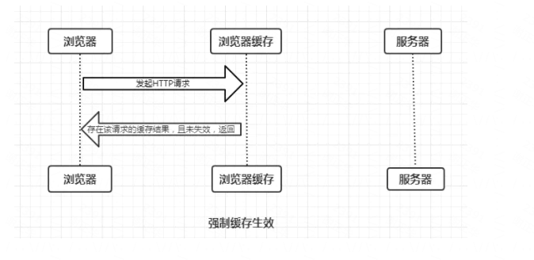
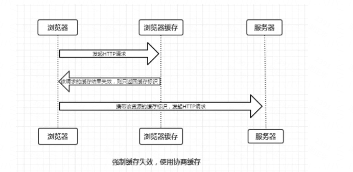
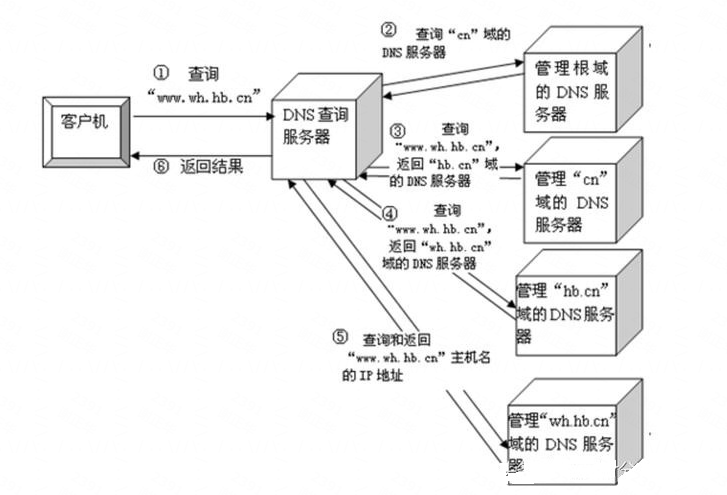
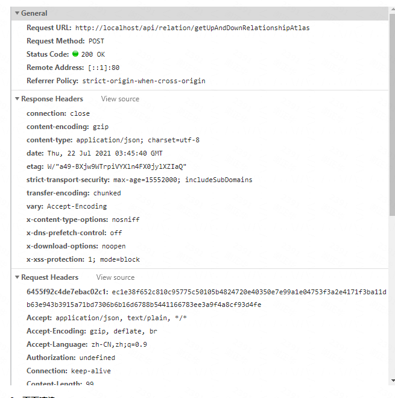
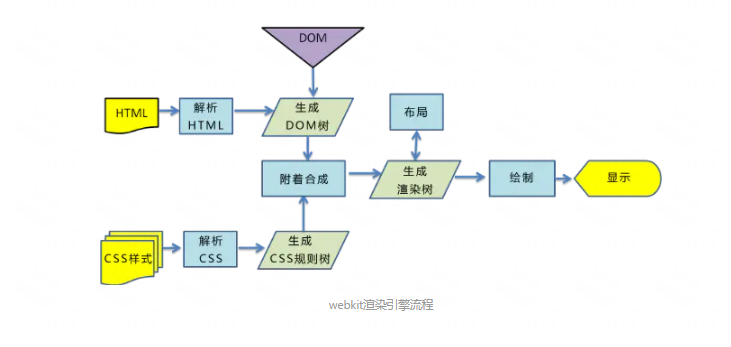

### **前言**

这个问题是前端面试的一个经典问题，你吃透了它，基本能掌握前端的大部分知识，经过对这个问题长时间的探索，我终于稍微理解了它，不容易啊。

### **过程**

整个过程主要分为以下步骤：

1. 浏览器的地址栏输入 url 并按下回车
2. 浏览器会根据你的 url 查看浏览器是否有缓存（DNS域名缓存），并且对比过期时间
3. DNS 根据 url 解析出 ip 地址，并且找到端口号
4. 三次握手建立连接
5. 浏览器发起 http 请求（这里也会查缓存，有可能强缓存，也有可能协商缓存）
6. 服务器接收到请求并处理，浏览器收到 http 响应
7. 进行页面渲染，构建 DOM 树，CSS 树等
8. 四次挥手断开连接。

接下来对其中的一些步骤展开细说。

### **URL 构成**

 我们常见的 URL 是这样的**:**http://www.baidu.com,这个域名由三部分组成：协议名、域名、端口号，这里端口是默认所以隐藏。除此之外URL还会包含一些路径、查询和其他片段，例如：http://www.tuicool.com/search?kw=%E4%。我们最常见的的协议是HTTP协议，除此之外还有加密的HTTPS协议、FTP协议、FILe协议等等。URL的中间部分为域名或者是IP，之后就是端口号了。通常端口号不常见是因为大部分的都是使用默认端口，如HTTP默认端口80，HTTPS默认端口443。

### **缓存**

浏览器缓存根据是否需要**重新向服务器发起请求**总共分为两类：强缓存和协商缓存。

**强缓存（不需要）对应的 HTTP 首部字段**：cache-control，Expires。

 Expires：是一个绝对时间，即服务器时间。浏览器检查当前时间，如果还没到失效时间就直接使用缓存文件。但是该方法存在一个问题：服务器时间与客户端（本地时间）时间可能不一致。因此该字段已经很少使用。（这个字段需要和 Last-modified 结合使用。Expires 是 Web 服务器响应消息头字段，在响应 http 请求时告诉浏览器在过期时间前浏览器可以直接从浏览器缓存取数据，而无需再次请求。）

 cache-control：这个字段中有一个指令 max-age，可以保存相对时间。

 如果同时存在 cache-control 和 Expires，浏览器总是优先使用 cache-control。

**协商缓存（需要）对应的 HTTP 两组字段**：If-since-modified 和 last-modified、if-none-match 和 Etag

 If-since-modified 和 last-modified：发送 HTTP 请求时携带 If-since-modified 字段，服务端收到请求时将这个字段的时间和服务器最后内容更新的时间进行对比，如果在在有效期内，则返回 304 状态码，告诉浏览器可以使用缓存。如果内容更新了，则返回 200 状态码，进行数据更新，并且 http 响应头携带最新的 last-modified 时间值返回。这组字段会存在一定的弊端，因为是根据文件修改时间来判定是否更新的，如果修改了文件，但内容没变，服务器的 last-modified 还是会更新。

 if-none-match 和 Etag：流程和上面的 last-modified 一样，只是 Etag 值是根据文件内容是否修改来进行判定，进行产生一个哈希字符串存在服务器的 Etag 中。

### **DNS 解析**

我们知道在地址栏输入的域名并不是最后资源所在的真实位置，域名只是与 IP 地址的一个映射。网络服务器的 IP 地址那么多，我们不可能去记一串串的数字，因此域名就产生了，域名解析的过程实际是将域名还原为 IP 地址的过程。

- 首先浏览器先检查本地 hosts 文件是否有这个网址映射关系，如果有就调用这个 IP 地址映射，完成域名解析。
- 如果没找到则会查找本地 DNS 解析器缓存，如果查找到则返回。
- 如果还是没有找到则会查找本地 DNS 服务器（一般采用递归查询），如果查找到则返回。
- DNS本地域名服务器向根域名服务器查询（一般采用迭代查询），按根域服务器 ->顶级域->第二层域 → 子域，找到 IP 地址。

迭代查询：主机向本地DNS服务器查询ip的过程中，本地DNS服务器通过递归，只会向主机返回ip地址或者未查询到的信息。

递归查询：本地DNS服务向根DNS服务器查询过程中，根DNS会向本地DNS服务器返回ip地址或者返回本地域名服务服务器下一步需要访问哪个DNS服务器的指示。

### **TCP 三次握手建立连接**

第一次握手：客户端向服务端发送请求，说：“我的序列号是 a1，想和你建立连接，你同意的话就回个确认消息 b 吧。”

第二次握手：服务端向客户端回应消息，说：’好的，收到，回你个确认消息 b，我的序列号是 a2，你想连接就回个消息 d 吧“。

第三次握手：客户端收到服务端消息并回应，说：”收到，回你个消息 d“

连接建立。

### **浏览器向服务器发送 HTTP 请求并接收到响应**

完整的 HTTP 请求包含请求起始行、请求头部、请求主体三部分。

服务器在收到浏览器发送的 HTTP 请求之后，会将收到的 HTTP 报文封装成 HTTP 的 Request 对象，并通过不同的 Web 服务器进行处理，处理完的结果以 HTTP 的 Response 对象返回，主要包括状态码，响应头，响应报文三个部分。

### **页面渲染**

浏览器渲染页面的过程总共分 5 步：

- 浏览器将获取的 HTML 文档解析成 DOM 树。
- 处理 CSS 标记，构成层叠样式表模型 CSSOM(CSS Object Model)。
- 将 DOM 和 CSSOM 合并为渲染树(`rendering tree`)，代表一系列将被渲染的对象。
- 渲染树的每个元素包含的内容都是计算过的，它被称之为布局`layout`。浏览器使用一种流式处理的方法，只需要一次绘制操作就可以布局所有的元素。
- 将渲染树的各个节点绘制到屏幕上，这一步被称为绘制`painting`。

需要注意的是，以上五个步骤并不一定一次性顺序完成，比如 DOM 或 CSSOM 被修改时，亦或是哪个过程会重复执行，这样才能计算出哪些像素需要在屏幕上进行重新渲染。

在实际情况中，JavaScript 和 CSS 的某些操作往往会多次修改 DOM 或者 CSSOM，从而导致**重绘**和**重排**等性能问题，要尽量避免。

**关于 js 阻塞：**JS 可以操作 DOM 来修改 DOM 结构，可以操作 CSSOM 来修改节点样式，这就导致了浏览器在遇到`<script>`标签时，DOM 构建将暂停，直至脚本完成执行，然后继续构建 DOM。如果脚本是外部的，会等待脚本下载完毕，再继续解析文档。现在可以在`script`标签上增加属性`defer`或者`async`。脚本解析会将脚本中改变 DOM 和 CSS 的地方分别解析出来，追加到 DOM 树和 CSSOM 规则树上。

### **四次挥手，断开连接**

第一次挥手：客户端向服务器发消息，说：’我没有数据要发送了，希望断开连接，如果同意就回复个消息 m”

第二次挥手：服务端向客户端发消息，说：‘收到，回你个消息 m’，消息发完之后，服务端在查数据是不是全部发完了。

第三次挥手：服务端向客户端发消息，说：‘我也没有数据要发送了，要断开连接了，同意就回个消息 n“

第四次挥手：客户端向服务端发消息，说：’收到，回你个消息 n‘。

断开连接。

参考文章：[输入 url 经历了什么](https://www.cnblogs.com/liutianzeng/p/10456865.html)、[页面渲染过程](https://blog.csdn.net/weixin_39307273/article/details/104918716)、[浏览器缓存机制](https://juejin.cn/post/6844903593275817998)
