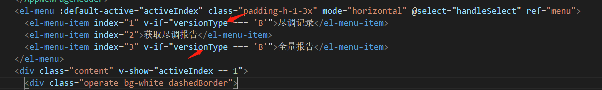
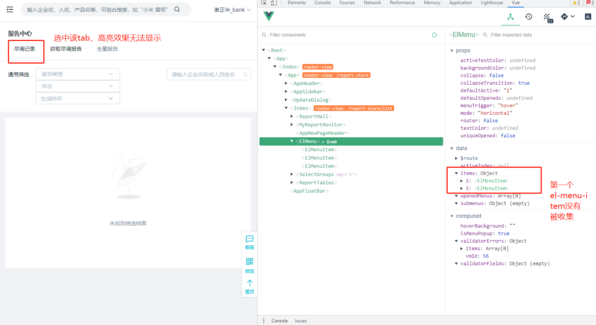
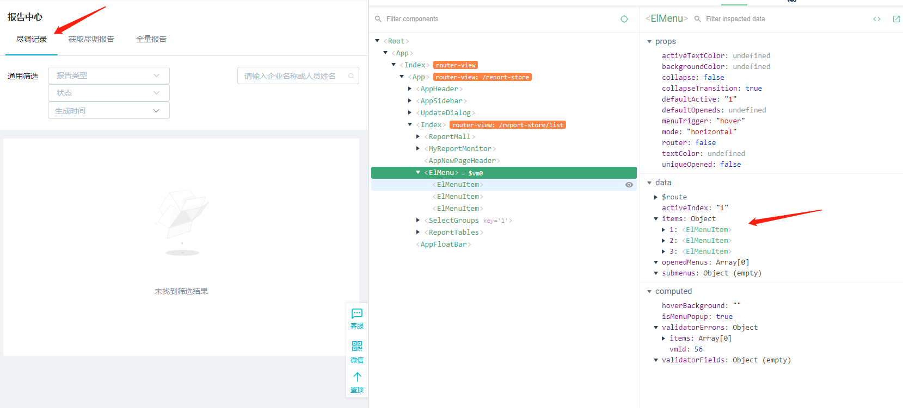

### **前言**

我在使用 element-ui 中的 el-menu 菜单栏组件的过程中，遇到了一个选中样式效果失效的问题，花了我挺久的时间才解决掉，element-ui 版本为 2.13。

### **描述**

我用 v-if 判断 el-menu-item 是否显示，会出现某一个 el-menu-item 无法被父组件 el-menu 收集，然后选中高亮效果消失

### **解决办法**

不用 v-if 判断，用 v-show 进行判断 el-menu-item

### **原因**

用 v-if 未渲染出 el-menu-item，可以用 v-show 在 mount 阶段之前提前渲染出来再进行判断。
