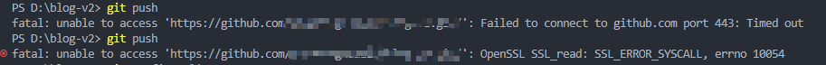
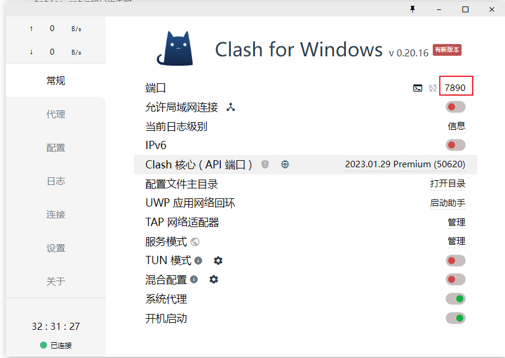

### 问题

平时开发过程中，当我们使用git拉取代码或者推送代码时，总是会遇到代理问题，如下截图所示：



这是由于git config中设置的代理有问题

### 解决方法

①如果你本地没有开例如vpn的代码，去掉即可

```
git config --global --unset http.proxy
git config --global --unset https.proxy
```

②如果本地开了vpn代理，将git代理端口设置为vpn代理端口即可

代码端口查看，以clash为例



设置git代理

```
git config --global  http.proxy http://127.0.0.1:7890
git config --global  https.proxy https://127.0.0.1:7890
```

设置完成之后就能正常拉取和推送代码啦。
