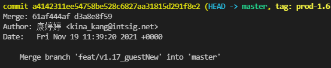

### **前言**

日常开发中，git 是多人协作开发中必不可少的代码管理工具，有时候，我们难免会遇到提交了错误代码的情况需要 git 回滚。下面我就总结一下：

### **git reset**

git reset 是回退到某一次 commit，并且把这个 commit 后面的所有 commit 全部删除。

git reset 包括 git reset --hard 和 git reset --soft，两者区别：--hard 会将强制回退到某个提交，会将你当前写的还未提交的代码删除；--soft 则只会回退到某个提交，不会删除当前未提交的代码。

相关命令：（HEAD 永远指向当前最新提交）

git reset --hard/--soft HEAD^ 回退到上一次提交

git reset --hard/--soft HEAD^^ 回退到上上次提交

git reset --hard/--soft commit_id 回退到某次 commit

当我们的代码已经 push 到远程仓库，再使用 git reset，会遇到无法 push 的情况，这时候只能强制 push：git push -f

### **git revert**

git revert 是撤销某些已经提交的 commit，并生成一次新的提交，是正向的，这点和 reset 不同。例如当前 commit 顺序：A->B->C->-D->E，我们需要移除提交 C：git revert C；我们需要移除 BCD：git revert A..D,后面跟的是一个前开后闭区间

相关命令：

git revert HEAD^ 撤销前一次提交（命令同 git reset）

**应用场景：**

正在开发的分支 branch,主分支 master。当我们将 branch 合并到 master 后，产生冲突修改并提交，产生 commit1，之后又提交了一个新的 commit2。上线之后，我们发现了 branch 合并的分支有严重的问题。这时候我们需要 revert 掉 commit1，并且保留在 master 上修改的冲突，应该怎么做呢？

所有的 merge 都会存在两个 commit，左边的是主分支的 commit，右边是合并分支 branch 的 commit

这时候我们需要保留 master 上的内容，revert 掉合并分支的内容,保留 master 上内容：git revert d3a8e8f59 或者 git revert -m 1 a4142311ee54758be528c6827aa31815d291f8e2（1 表示左边，2 表示右边），revert 之后，master 上面会产生一个新的 commit3

当 branch 的上 bug 改好后，此时我们需要将 master 上的 commit3 提交 revert 掉，才能将 branch 合并到 master，不然会没有效果。
