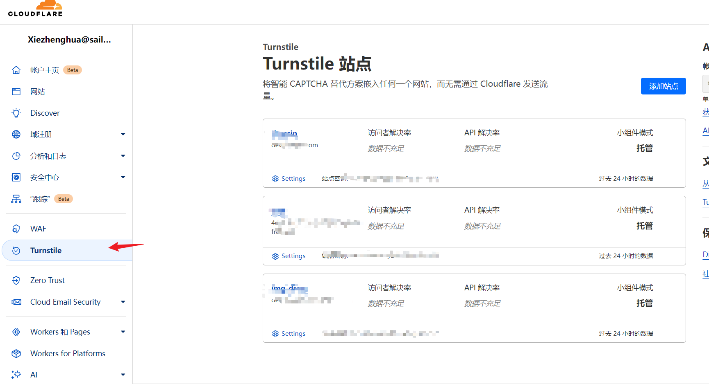

### 什么是人机验证？

人机验证（CAPTCHA）是一种用于区分人类用户和自动化脚本（机器人）的技术，通常用于网站和在线服务中来防止恶意行为。常见应用场景：恶意登录、恶意注册和其他恶意操作等等。

### 常见人机验证解决方案

##### 1、**Cloudflare Turnstile（推荐）**

 **特点** ：

* 无感知验证，用户无需进行额外操作。
* 免费使用，适合各种网站。

 **适用场景** ：

* 适合任何需要高用户体验的网站，尤其是门户网站、电子商务网站等。

 **优点** ：

* 提升用户体验。
* 提供强大的安全防护。

 **参考链接** ：
[Cloudflare Turnstile](https://developers.cloudflare.com/turnstile/)

##### 2、**Google reCAPTCHA**

 **特点** ：

* 提供多种验证方式，包括点击复选框、图片选择和无感知验证。
* 使用方便，支持多种编程语言和框架。

 **适用场景** ：

* 广泛用于各种类型的网站和应用程序，适合保护登录页面、注册页面、表单提交等。

 **优点** ：

* 高准确性和防护效果。
* 无感知模式不会影响用户体验。

 **参考链接** ：
[Google reCAPTCHA](https://www.google.com/recaptcha/)

##### 3、**hCaptcha**

 **特点** ：

* 类似于Google reCAPTCHA，通过图片选择等任务来验证用户。
* 支持无感知验证，且具备良好的隐私保护。

 **适用场景** ：

* 网站和应用程序需要高隐私和数据保护的网站。

 **优点** ：

* 良好的隐私保护。
* 免费和商业版本可选。

 **参考链接** ：
[hCaptcha](https://www.hcaptcha.com/)

##### 4、**BotDetect CAPTCHA**

 **特点** ：

* 提供多种验证码类型，包括文字验证码、数学验证码等。
* 离线工作，不依赖外部服务。

 **适用场景** ：

* 对隐私要求高且不希望依赖外部网络服务的网站和应用程序。

 **优点** ：

* 高度可定制。
* 离线工作，安全性高。

 **参考链接** ：
[BotDetect CAPTCHA](https://captcha.com/)

国内版本常见有腾讯云验证码、阿里云验证码、极验（GeeTest）、网易易盾等等。

### Cloudflare Turnstile使用（[文档](https://developers.cloudflare.com/turnstile/)）

**web端使用：**

[客户端](https://developers.cloudflare.com/turnstile/get-started/client-side-rendering/)（在线api.js不能用script动态引入，否则无法识别） 、[服务端](https://developers.cloudflare.com/turnstile/get-started/server-side-validation/)

**APP端使用：**

（这里使用uniapp框架，使用webview方式）

因为Cloudflare Turnstile需要依赖于域名进行人机验证，所以需要单独将验证码页面单独部署到某一个域名

```html
<!DOCTYPE html>
<html lang="en">
  <head>
    <meta charset="UTF-8" />
    <meta name="viewport" content="width=device-width, initial-scale=1.0" />
    <title>safeCode</title>
  </head>
  <body>
    <div id="cf-code"></div>
    <script src="http://dev-img.dressin.com/js/uniapp.js"></script> 
    <script src="https://challenges.cloudflare.com/turnstile/v0/api.js?render=explicit"></script>
    <script type="text/javascript">
      document.addEventListener('plusready', function () {
        wv = plus.webview.currentWebview()
        console.log('plusready', wv.getURL())
      })
      document.addEventListener('UniAppJSBridgeReady', function () {
        console.log(this)
        turnstile.ready(function () {
         turnstile.render('#cf-code', {
            sitekey: '站点的验证码密钥',
            callback: function (response) {
              console.log('cf-code', response)
            }
          })
        })yaz
      })
    </script>
  </body>
</html
```

**密钥获取位置**



[uniapp webview文档](https://zh.uniapp.dcloud.io/component/web-view.html#web-view)

js封装代码

```javascript
// 创建webview验证码, 仅在APP-PLUS环境下有效

const htmlPath = 'http://dev-img.dressin.com/html/safeCode.html'  //这里写部署的html地址

class CreateTurnstile {
 constructor(uniScope) {
  this.$scope = uniScope
  this.wv = this.create()
 }

 create() {
  const wv = plus.webview.create('', this.createId(), {
   background: 'transparent',
   popGesture: 'none',
   scrollIndicator: 'none',
   scrollBounce: 'none',
   bounce: 'none',
   bounceBackground: '#ffffff',
   top: '0px',
   bottom: '0px',
   left: '0px',
   right: '0px',
   // zindex: 9999
  })  //具体样式可以自己调整
  wv.loadURL(htmlPath)
  const currentWebview = this.$scope.$getAppWebview()
  currentWebview.append(wv)
  return wv
 }

 show() {
  this.wv.show()
 }
 hide() {
  this.wv.hide()
 }
 destroy() {
  this.wv.removeFromParent()
  this.wv.close()
  this.wv = null
 }
 createId() {
  return `safeCode_${Date.now()}`
 }
}

export default CreateTurnstile
```
