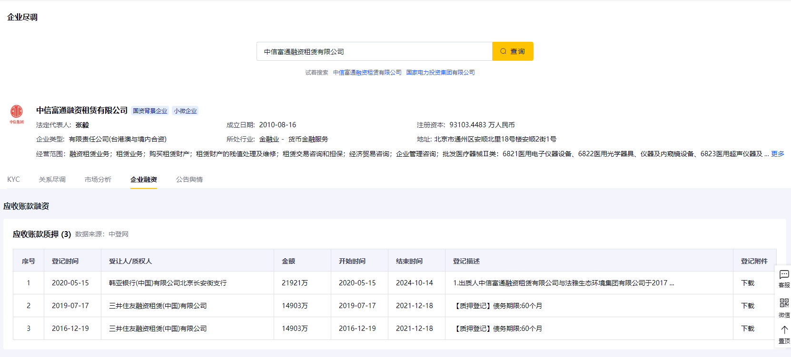
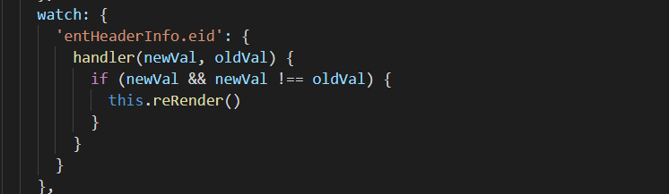
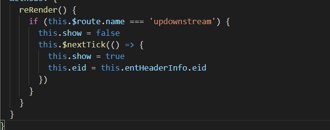
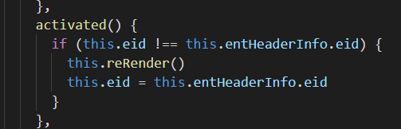
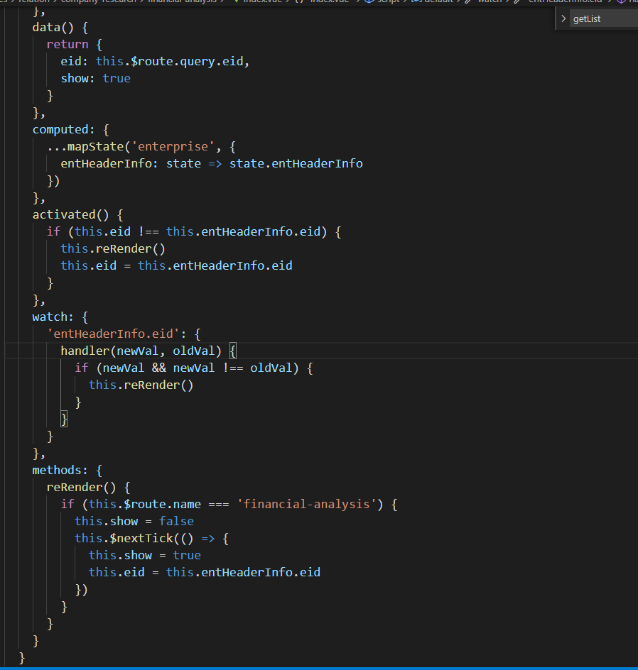

### **前言**

项目开发过程中，我遇到到了这样一个问题，当时有这样一个需求，上方搜索一个企业，下面的几个 tab 页展示对应的数据。

我开始设计时，把每一个 tab 页当成一个路由，然后把这个企业的 eid 传到每个 tab 页中（每个 tab 页用 watch 进行监听），进行数据展示。这样就会存在一个问题，我只要一搜索企业，下面的每个 tab 页中的接口都会调用，很不友好。

所以，希望设计成这样：切换到每个 tab 页时，才调用对应的接口，并且同一家公司，tab 页切换过去一次后，第二次切换过去，不需要再调接口。

### **开发过程**

首先，tab 监听 eid 时要判断是否有新的 eid 进来，如果有才进行接口调用，因为 vue 数据更新就是通过 watch 来操作的，只要数据更新了，每个子组件的 watch 都会执行到。我最开始设计的时候没有执行到这个情况，所以一搜索企业，就会调用所有接口。

里面的 reRender 函数是强制刷新函数(利用 v-if 进行子组件强制刷新，利用 keep-alive 缓存 eid)

然后，每个组件都在自己的 mounted 或者 created 生命周期请求接口。

tab 页切换时，利用 actived 生命周期进行一些操作，判断缓存的 eid 是否和新的 eid 相等，是的话就不做什么，不是的话就进行刷新操作

### **最终代码**

