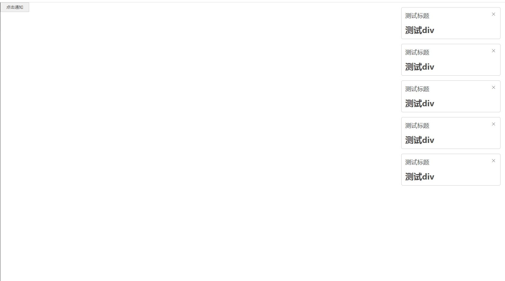

### 前言

看了挺久的vue3的组合式api，一直没有实际练习，终于找了个时间下手了，来总结一波。

### 什么是组合式api？

组合式 API (Composition API) 是一系列 API 的集合，使我们可以使用函数而不是声明选项的方式书写 Vue 组件。它是一个概括性的术语，涵盖了以下方面的 API：

- [响应式 API](https://cn.vuejs.org/api/reactivity-core.html)：例如 `ref()` 和 `reactive()`，使我们可以直接创建响应式状态、计算属性和侦听器。
- [生命周期钩子](https://cn.vuejs.org/api/composition-api-lifecycle.html)：例如 `onMounted()` 和 `onUnmounted()`，使我们可以在组件各个生命周期阶段添加逻辑。
- [依赖注入](https://cn.vuejs.org/api/composition-api-dependency-injection.html)：例如 `provide()` 和 `inject()`，使我们可以在使用响应式 API 时，利用 Vue 的依赖注入系统。

组合式 API 是 Vue 3 及 [Vue 2.7](https://blog.vuejs.org/posts/vue-2-7-naruto.html) 的内置功能。对于更老的 Vue 2 版本，可以使用官方维护的插件 [`@vue/composition-api`](https://github.com/vuejs/composition-api)。在 Vue 3 中，组合式 API 基本上都会配合setup语法在单文件组件中使用。

### 为什么要有组合式api？

**1、更好的逻辑复用**

组合式 API 最基本的优势是它使我们能够通过[组合函数](https://cn.vuejs.org/guide/reusability/composables.html)来实现更加简洁高效的逻辑复用。在选项式 API 中我们主要的逻辑复用机制是 mixins，而组合式 API 解决了 [mixins 的所有缺陷](https://cn.vuejs.org/guide/reusability/composables.html#vs-mixins)。

**2、更灵活的代码组合**

许多用户喜欢选项式 API 的原因是它在默认情况下就能够让人写出有组织的代码：大部分代码都自然地被放进了对应的选项里。然而，选项式 API 在单个组件的逻辑复杂到一定程度时，会面临一些无法忽视的限制。这些限制主要体现在需要处理多个**逻辑关注点**的组件中，这是我们在许多 Vue 2 的实际案例中所观察到的。

**3、更好的类型推导**

近几年来，越来越多的开发者开始使用 [TypeScript](https://www.typescriptlang.org/) 书写更健壮可靠的代码，TypeScript 还提供了非常好的 IDE 开发支持。然而选项式 API 是在 2013 年被设计出来的，那时并没有把类型推导考虑进去，因此我们不得不做了一些[复杂到夸张的类型体操](https://github.com/vuejs/core/blob/44b95276f5c086e1d88fa3c686a5f39eb5bb7821/packages/runtime-core/src/componentPublicInstance.ts#L132-L165)才实现了对选项式 API 的类型推导。但尽管做了这么多的努力，选项式 API 的类型推导在处理 mixins 和依赖注入类型时依然不甚理想。

因此，很多想要搭配 TS 使用 Vue 的开发者采用了由 `vue-class-component` 提供的 Class API。然而，基于 Class 的 API 非常依赖 ES 装饰器，在 2019 年我们开始开发 Vue 3 时，它仍是一个仅处于 stage 2 的语言功能。我们认为基于一个不稳定的语言提案去设计框架的核心 API 风险实在太大了，因此没有继续向 Class API 的方向发展。在那之后装饰器提案果然又发生了很大的变动，在 2022 年才终于到达 stage 3。另一个问题是，基于 Class 的 API 和选项式 API 在逻辑复用和代码组织方面存在相同的限制。

相比之下，组合式 API 主要利用基本的变量和函数，它们本身就是类型友好的。用组合式 API 重写的代码可以享受到完整的类型推导，不需要书写太多类型标注。大多数时候，用 TypeScript 书写的组合式 API 代码和用 JavaScript 写都差不太多！这也让许多纯 JavaScript 用户也能从 IDE 中享受到部分类型推导功能。

**4、更小生产包体积**

搭配 `<script setup>` 使用组合式 API 比等价情况下的选项式 API 更高效，对代码压缩也更友好。这是由于 `<script setup>` 形式书写的组件模板被编译为了一个内联函数，和 `<script setup>` 中的代码位于同一作用域。不像选项式 API 需要依赖 `this` 上下文对象访问属性，被编译的模板可以直接访问 `<script setup>` 中定义的变量，无需一个代码实例从中代理。这对代码压缩更友好，因为本地变量的名字可以被压缩，但对象的属性名则不能。

以上均来自vue3文档官网。

### vue版本

vue2.7

### 实现效果

类似于element ui的简易版通知弹窗（直接函数调用，只能在上方）



### 代码逻辑

**natification.vue文件**

```vue
<template>
  <transition name="fade" @before-leave="onClose">
    <div
      v-if="visible"
      :id="id"
      class="notification"
      :class="[horizontalClass]"
      :style="positionStyle"
      @mouseenter="clearTimer"
      @mouseleave="startTimer"
    >
      <div class="title">{{ title }}</div>
      <i class="h-icon-close closeBtn" @click="close"></i>
      <div v-show="message">
        <slot>
          <p v-html="message"></p>
        </slot>
      </div>
    </div>
  </transition>
</template>
<script>
export default {
  name: 'Notification',
}
</script>
<script setup>
// import { notificationProps } from './type'
import { ref, onMounted, onUnmounted, computed } from 'vue'
// defineOptions({
//   name: 'notification',
// })

const visible = ref(false)
const close = () => {
  visible.value = false
}
// const props = defineProps(notificationProps)
const props = defineProps({
  duration: {
    type: Number,
    default: 2000,
  },
  message: {
    type: String,
    default: '',
  },
  title: {
    type: String,
    default: '',
  },
  position: {
    type: String,
    default: 'right',
  },
  id: {
    type: String,
    default: '',
  },
  onClose: {
    type: Function,
    default: () => true,
    required: true,
  },
  offset: {
    type: Number,
    default: 0,
  },
})

let timer = null
const startTimer = () => {
  if (props.duration > 0) {
    timer = setTimeout(() => {
      if (visible.value) close()
    }, props.duration)
  }
}
onMounted(() => {
  visible.value = true
  startTimer()
})
const clearTimer = () => {
  clearTimeout(timer)
}
onUnmounted(() => {
  clearTimer()
})
const horizontalClass = computed(() => (props.position === 'right' ? 'right' : 'left'))
const positionStyle = computed(() => {
  return {
    top: `${props.offset}px`,
  }
})
</script>

<style lang="scss" scoped>
.notification {
  width: 330px;
  padding: 12px;
  background-color: #fff;
  border: 1px solid #ccc;
  border-radius: 5px;
  position: fixed;
  transition: all 0.5s ease;
  overflow: hidden;
  .closeBtn {
    position: absolute;
    top: 12px;
    right: 12px;
    font-size: 20px;
    cursor: pointer;
  }
  .title {
    font-size: 20px;
    margin-bottom: 16px;
  }
}
.right {
  right: 16px;
}
.left {
  left: 16px;
}

.fade-enter-active,
.fade-leave-active {
  transition: all 0.5s ease;
}
.fade-enter {
  &.right {
    right: 0;
    transform: translateX(100%);
  }

  &.left {
    left: 0;
    transform: translateX(-100%);
  }
}
.fade-leave-to {
  opacity: 0;
}
</style>

```

**natification.js文件，导出实例**

```javascript
import notification from './notification.vue'
import Vue from 'vue'
const GAP_SIZE = 16
let seed = 1
const notificationQueue = []

const notify = options => {
  const id = `notification_${seed++}`

  let verticalOffset = options.offset || 0
  notificationQueue.forEach(({ vm }) => {
    verticalOffset += (vm.$el.offsetHeight || 0) + GAP_SIZE
  })
  verticalOffset += GAP_SIZE

  const div = document.createElement('div')
  document.querySelector('#app').appendChild(div)
  const instance = Vue.extend(notification)
  const vm = new instance({
    propsData: {
      ...options,
      offset: verticalOffset,
      id,
      onClose: () => {
        close(id)
      },
    },
  }).$mount(div)
  notificationQueue.push({ vm })
  return { close: vm.close }
}

const close = id => {
  const idx = notificationQueue.findIndex(({ vm }) => {
    return vm._props.id === id
  })
  if (idx === -1) return
  const { vm } = notificationQueue[idx]
  if (!vm) return
  const removedHeight = vm.$el.offsetHeight
  notificationQueue.splice(idx, 1)
  const len = notificationQueue.length
  if (len < 1) return
  for (let i = idx; i < len; i++) {
    // new position equals the current offsetTop minus removed height plus 16px(the gap size between each item)
    const { $el, _props } = notificationQueue[i].vm
    const pos = Number.parseInt($el.style['top'], 10) - removedHeight - GAP_SIZE
    _props.offset = pos
  }
}

export { notificationQueue }

export default notify
```

**使用**：直接引入natification.js文件，传入相应参数即可

```javascript
 duration: {
    type: Number,
    default: 2000,
  },
  message: {
    type: String,
    default: '',
  },
  title: {
    type: String,
    default: '',
  },
  position: {
    type: String,
    default: 'right',
  },
  id: {
    type: String,
    default: '',
  },
  onClose: {
    type: Function,
    default: () => true,
    required: true,
  },
  offset: {
    type: Number,
    default: 0,
  },
```
