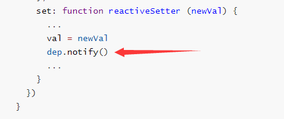
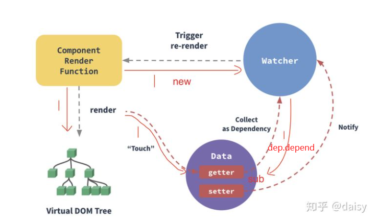
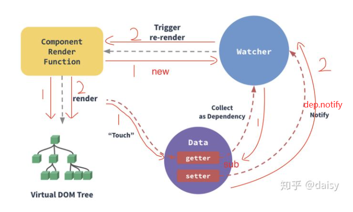

### **前言**

看了好久的vue响应式原理，一直没看懂，直到我最近看到了实习公司的一位同事写的一篇分享文章，然后结合vue技术揭秘，终于对它有一点点的感悟了。

### **核心**

Vue响应式的核心是利用Object.defineProperty()这个方法进行数据劫持和观察者模式进行数据响应式的。Object.defineProperty()这个方法会直接在一个对象上定义一个新属性，或者修改一个对象的现有属性，并返回此对象。具体用法如下：

    它有三个参数，第一个是object，它代表要定义属性的对象。；第二个是prop，它代表目标对象的属性值；第三个参数是descriptor，它代表要定义或修改的属性描述符。

    响应式用法：

```javascript
const person = {}
Object.defineProperty(person, 'name', {
    get: function() {
        console.log('获取到name了')
    },
    set: function(val) {
        console.log('设置了name为' + val)
    }
})
person.name  //获取到name了
person.name = '小谢'  //设置了name为小谢
```

### **观察者模式**

什么是观察者模式？它分为**注册环节跟发布环节**。

比如我去买芝士蛋糕，但是店家还没有做出来。这时候我又不想在店外面傻傻等，我就需要隔一段时间来回来问问蛋糕做好没，对于我来说是很麻烦的事情，说不定我就懒得买了。

店家肯定想要做生意，不想流失我这个吃货客户。于是，在蛋糕没有做好的这段时间，有客户来，他们就让客户把自己的电话留下，这就是观察者模式中的**注册环节**。然后蛋糕做好之后，一次性通知所有记录了的客户，这就是观察者的**发布环节**。

一个简单的观察者模式类：

```javascript
function Observer() {
  this.dep = [];
  
  register(fn) {
    this.dep.push(fn)
  }
  
  notify() {
    this.dep.forEach(item => item())
  }
}

const wantCake = new Oberver();
// 每来一个顾客就注册一个想执行的函数
wantCake.register(() => {'console.log("call daisy")'})
wantCake.register(() => {'console.log("call anny")'})
wantCake.register(() => {'console.log("call sunny")'})

// 最后蛋糕做好之后，通知所有的客户
wantCake.notify()
```

### **初始化**

vue在初始化执行initState的时候，会对 `props`、`methods`、`data`、`computed` 和 `wathcer` 等属性做初始化操作。

```javascript
export function initState (vm: Component) {
  vm._watchers = []
  const opts = vm.$options
  if (opts.props) initProps(vm, opts.props)
  if (opts.methods) initMethods(vm, opts.methods)
  if (opts.data) {
    initData(vm)
  } else {
    observe(vm._data = {}, true /* asRootData */)
  }
  if (opts.computed) initComputed(vm, opts.computed)
  if (opts.watch && opts.watch !== nativeWatch) {
    initWatch(vm, opts.watch)
  }
}
```

在初始化data的时候，一共做了两件事，一件是利用proxy将数据代理到整个vue实例上，另一件就是将data中的所有对象属性reactive化，变成响应式对象，为对象添加getter和setter。

```javascript
/**
 * Observer class that is attached to each observed
 * object. Once attached, the observer converts the target
 * object's property keys into getter/setters that
 * collect dependencies and dispatch updates.
 */
export class Observer {
  value: any;
  dep: Dep;
  vmCount: number; // number of vms that has this object as root $data

  constructor (value: any) {
    this.value = value
    this.dep = new Dep()
    this.vmCount = 0
    def(value, '__ob__', this)
    if (Array.isArray(value)) {
      const augment = hasProto
        ? protoAugment
        : copyAugment
      augment(value, arrayMethods, arrayKeys)
      this.observeArray(value)
    } else {
      this.walk(value)
    }
  }

  /**
   * Walk through each property and convert them into
   * getter/setters. This method should only be called when
   * value type is Object.
   */

  walk (obj: Object) {
    const keys = Object.keys(obj)
    for (let i = 0; i < keys.length; i++) {
      defineReactive(obj, keys[i])
    }
  }

  /**
   * Observe a list of Array items.
   */
  observeArray (items: Array<any>) {
    for (let i = 0, l = items.length; i < l; i++) {
      observe(items[i])
    }
  }
}
```

我们关注上面的这段代码，它将对象的所有属性进行遍历执行defineReactive()方法进行响应式化

```javascript
  walk (obj: Object) {
    const keys = Object.keys(obj)
    for (let i = 0; i < keys.length; i++) {
      defineReactive(obj, keys[i])
    }
  }
```

在执行这个方法的过程中，会new一个dep实例，记得注意，后面会用到

```javascript
function defineReactive(obj: Object, key: string, ...) {
    const dep = new Dep()

    Object.defineProperty(obj, key, {
      enumerable: true,
      configurable: true,
      get: function reactiveGetter () {
        ....
        dep.depend()
        return value
        ....
      },
      set: function reactiveSetter (newVal) {
        ...
        val = newVal
        dep.notify()
        ...
      }
    })
  }
  
  class Dep {
      static target: ?Watcher;
      subs: Array<Watcher>;

      depend () {
        if (Dep.target) {
          Dep.target.addDep(this)
        }
      }

      notify () {
        const subs = this.subs.slice()
        for (let i = 0, l = subs.length; i < l; i++) {
          subs[i].update()
        }
      }
```

上述代码中的Dep类就是一个观察者类，每个对象属性都一个dep实例对象，在执行get的时候进行触发depend方法，触发sit的时候执行notify方法。

### **mount阶段**

在vue实例挂载阶段，会创建一个Watcher类的实例对象，这个Watcher实际上是连接Vue组件与Dep（也就是视图更新环节）的桥梁。

```javascript
mountComponent(vm: Component, el: ?Element, ...) {
    vm.$el = el

    ...

    updateComponent = () => {
      vm._update(vm._render(), ...)
    }

    new Watcher(vm, updateComponent, ...)
    ...
}

class Watcher {
  getter: Function;

  // 代码经过简化
  constructor(vm: Component, expOrFn: string | Function, ...) {
    ...
    this.getter = expOrFn
    Dep.target = this                      // 注意这里将当前的Watcher赋值给了Dep.target
    this.value = this.getter.call(vm, vm)  // 调用组件的更新函数
    ...
  }
}
```

在rende()方法将模板渲染成虚拟Vnode的过程中会访问data，从而触发属性的getter，然后每个对象属性又有一个dep实例对象（上面提到的），然后再getter的逻辑中又会调用该dep的depend方法，将watcher实例add到sub（存在Dep类中的存储watcher的数组）里面。在depend方法里面，Dep.target就是watcher本身，在Wacher类中的构造函数会执行（上面代码有）。以上过程就叫**依赖收集**。

### **派发更新**

在对象属性的数据改变之后，会触发sitter，从而执行sitter函数的逻辑，从而调用dep实例的notify方法，从而进行遍历调用sub中所有watcher的upadte方法进行视图更新。



### **总结**

**第一步：**组件初始化的时候，先给每一个Data属性都注册getter，setter，也就是reactive化。然后再new 一个自己的Watcher对象，此时watcher会立即调用组件的render函数去生成虚拟DOM。在调用render的时候，就会需要用到data的属性值，此时会触发getter函数，将当前的Watcher函数注册进sub里。



**第二步：**当data属性发生改变之后，会触发sitter，遍历sub里所有的watcher对象，通知它们去重新渲染组件。



**注意：vue对数组响应式是通过变异方法完成的，而且如果要对响应式对象添加新的属性，必须要用$set方法才能完成**

参考文章：

[vue技术揭秘](https://ustbhuangyi.github.io/vue-analysis/v2/reactive/)

[最简化 VUE的响应式原理](https://zhuanlan.zhihu.com/p/88648401)
