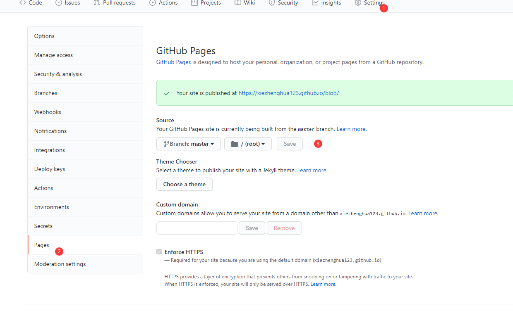

#### 初始化 vuepress

```bash
mkdir yourBlogName && cd yourBlogName #创建一个文件夹并进入，也可以直接在创建用vscode打开该文件夹
npm init #用npm初始化，也可以用其他的
npm install vuepress -D #安装vuepress
npm install vuepress-theme-hope -D #安装vuepress-theme-hope主题
npm install #最好npm install一下，防止包丢失
```

#### 修改 package.json 文件

添加以下代码

```javascript
"scripts": {
    "dev": "vuepress dev docs",
    "build": "vuepress build docs"
}
```

#### 第一篇文章

1、在根目录下新建 docs 文件夹

2、在 docs 文件夹下面新建 readme.md 文件（这是作为首页）

[首页配置参照](https://vuepress-theme-hope.github.io/zh/guide/layout/home/#home)

#### vuepress-theme-hope 主题配置

1、在 docs 文件夹下新建.vuepress 文件夹

2、在.vuepress 文件夹下新建 config.js 文件

具体内容：

```javascript
const { config } = require("vuepress-theme-hope")

module.exports = config({
  // your config here
})
#必须要按照以上写法，不能使用vuepress官方文档的写法
#具体配置项参照：https://vuepress-theme-hope.github.io/zh/config/
```

#### 打包

1、运行npm run build

2、由于我在配置文件中设置的是 dest: 'public', 所以打包完成后根目录会出现一个public文件夹，里面是打包后的内容，点开index.html文件会出现样式丢失，这个不用管，因为用的是相对路径，所以只有上线部署后才会有样式。

#### 部署

我是部署到github上的，由于我不是第一次部署，所以仓库名已经被占用了，我用的是另一个仓库

[具体看官网文档](https://vuepress.vuejs.org/zh/guide/deploy.html#github-pages)

但我想在我的github博客仓库中设立两个分支，一个分支存放我博客的所有内容，一个分支存放打包后的页面

思路：主分支master存放打包后的页面，另一个分支存放我博客的所有内容

在根目录下新建一个deploy.sh文件

内容

```bash
#!/usr/bin/env sh

# 确保脚本抛出遇到的错误
set -e

# 生成静态文件
npm run build

# 进入生成的文件夹
cd public
# 如果是发布到自定义域名
# echo 'www.example.com' > CNAME

git init
git add *
git commit -m '发布'

# 如果发布到 https://<USERNAME>.github.io
# git push -f git@github.com:<USERNAME>/<USERNAME>.github.io.git master

# 如果发布到 https://<USERNAME>.github.io/<REPO>
git push -f git@github.com:xiezhenghua123/blob.git master #这是我的仓库名

cd -
```

注意：这个文件必须用git打开才能正常运行

写好文章后运行这个文件，命令：./deploy.sh

运行过程中，项目会自动打包，然后上传到github博客仓库中的master分支

github上需要操作的步骤：



完成以上步骤，博客就能访问了。

为了防止本地仓库丢失，我们需要把整个博客文件上传到github仓库上的public（名字自己定）分支

```bash
git checkout -b public #本地新建一个public分支
git add *
git commit -m 'xxx'
git push -f --set-upstream origin public
```

#### 写好文章后发布的完整步骤

```bash
./deploy.sh 
git checkout -b public #本地新建一个public分支,只需要运行一次进行，以后不要切换分支
git add *
git commit -m 'xxx'
git push -f --set-upstream origin public #运行之后，以后就只要git push就行
```

博客发布流程已经换成Github Pages
