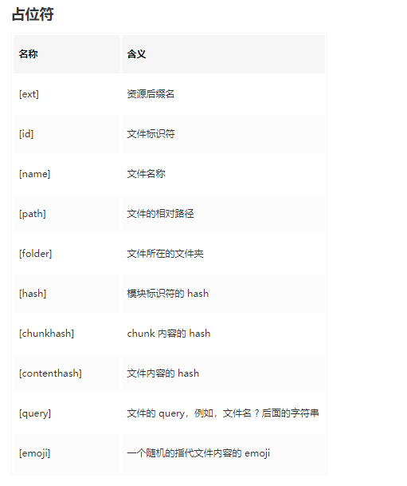

### 简介

webpack是一个前端资源构建工具，一个静态模块打包器。

webpack有统一入口文件，将所有的资源文件分别输出为代码块（chunk），再根据依赖打包成对应的静态资源（bundle）。

### 五个核心概念

#### 1、entry

入口（entry）只是webpack应该使用哪个文件作为入口起点开始打包。分析构建内部依赖图。默认值为./src/index.js。可以设置单入口和多入口。

#### 2、output

输出（output）告诉webpack在哪里输出它所创建的bundle。以及如何命名。主要输出文件默认值为./dist/main.js，其他文件默认放置./dist文件夹。

三种hash：

①fullhash  全量hash 只要项目中的任何一个文件内容发生变动，打包文件hash都会变化

②chunkhash  根据不同的入口文件进行依赖文件分析、生成chunkhash、当某个文件发生变动时，再次打包时，只有该文件以及依赖该文件的hash文件值发生改变

#### 3、loader

webpack只能理解js和json文件，loader可以让webpack能够去处理其他类型的文件，比如less、scss等。

配置loader需要放到module的rules里面，每个loader拥有test（识别哪些文件会被转换），use（使用哪个loader）。

编写一个简单loader：

```javascript
module.exports = function(source){
    /* 
    TODO source .....
    */
    return source // or this.callback(null, source) 
}
```

常见loader：sass-loader、style-loader、less-loader、file-loader、url-loader、babel-loader等，[官文链接](https://webpack.docschina.org/loaders/)

**webpack5处理字体文件图片等资源的loader已经内置，若想使用旧版本公共，需要添加：type: 'javascript/auto'**

[官文链接](https://webpack.docschina.org/guides/asset-modules/)

#### 4、plugins

插件比loader的作用更加强大，可以执行范围更广的任务。包括：打包优化、资源管理，注入环境变量等。

编写一个简单plugin：

五步：

1、实现一个js函数或者类。

2、在函数原型中定义一个注入complier的apply方法。

3、apply函数中通过complier插入指定的事件钩子，在钩子回调中拿到compliation对象。

4、使用compliation操纵修改内部实例数据。

5、功能完成后调用weboack的回调。

complier：代表了完整的webpack环境配置，这个对象在webpack启动时就一次性被建立，可以访问options、hook、loader和plugin等。

compilation：ciompilation模块会被complier用来创建新的编译，它能访问所有的模块以及依赖，它会对应用程序的依赖图中所有模块进行字面上的编译(literal compilation)。在编译阶段，模块会被加载(loaded)、封存(sealed)、优化(optimized)、分块(chunked)、哈希(hashed)和重新创建(restored)。

```javascript
function PluginDemo(options) {
  console.log(options.data);
}
PluginDemo.prototype.apply = function (compiler) {
  //complier.plugin语法已经废弃，内部异步需要使用tapAsync(异步内容需要使用callback回调)，tapPromise(返回   promise)，具体看官方文档。
  compiler.hooks.done.tap("PluginDemo", (compilation) => {
    // TODO
    console.log("compilation", compilation);
  });
};
module.exports = PluginDemo;
```

[官文链接](https://webpack.docschina.org/contribute/writing-a-plugin)

常见plugin：HtmlWebPlugin，CleanWebpackPlugin（webpack5已经内置，[链接](https://webpack.docschina.org/guides/output-management/#cleaning-up-the-dist-folder)）、MiniCssExtractPlugin

#### 5、mode

有development和production两种，分别代表开发环境和生产环境。

package.json里面执行不同的wepack配置文件需要加--config

```javascript
 "scripts": {
    "test": "echo \"Error: no test specified\" && exit 1",
    "build": "webpack --config webpack/webpack.prod.js",
    "dev": "webpack serve --config  webpack/webpack.dev.js"
  },
```

#### 处理js资源

**Eslint**（js和jsx检查工具：.eslintrc.*）

[具体规则](https://eslint.bootcss.com/docs/rules/)

**babel**（js编译器，将es6高级语法编译成浏览器可识别的低级语法：babel.config.*）

[具体规则](https://www.babeljs.cn/)

#### devServer开发服务器搭建

[官方文档](https://webpack.docschina.org/guides/development/#using-webpack-dev-server)

**sourceMap使用**

追踪错误代码，方便调试开发。[文档](https://webpack.docschina.org/configuration/devtool)

开发模式一般用"cheap-module-spurce-map",生产环境一般用“source-map”

**code Split代码分割**

用于多入口项目。[文档](https://webpack.docschina.org/guides/code-splitting/#dynamic-imports)

#### js兼容性问题

promise等es6+的语法，浏览器不识别，使用@babel/preset和core-js可以解决，在babel.config.js中进行配置，[文档](https://babeljs.io/docs/en/babel-preset-env#usebuiltins)

```javascript
presets: [
    [
      "@babel/preset-env",
      {
        useBuiltIns: "usage",
        corejs: { version: 3, proposals: true }
      },
    ],
  ],
```

#### 动态引入

[文档](https://webpack.docschina.org/api/module-methods/#import)  注：import()中的表达式不能使用完全动态参数。

**踩坑：**

1、路径问题

path.resolve(__dirname,'../src/loader/replaceLoader.js')中的"dirname"表示当前配置文件的绝对路径。

不使用path.resolve加绝对路径的话只需要写成'./src/loader/replaceLoader.js'

2、文件指纹


