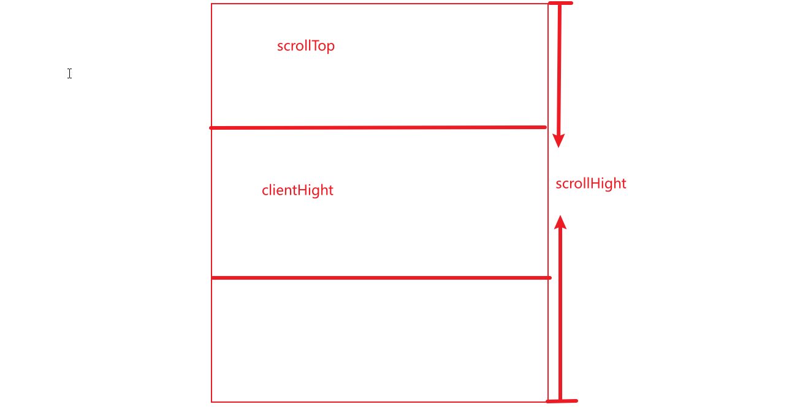

### 实现原理

监听scroll事件，当scrollTop+clientHeight >= scrollHeight时，即已经滚动到列表底部，可以加载下一页数据。



### 响应式问题

当项目中使用rem或者vw来实现响应式布局时，不同屏幕下要小心px值转rem或者vw时的部分小数位丢失问题，因为这样会导致scrollHeight会一直比scrollTop + clientHeight的值小，无法触发下一页数据请求。目前我的解决办法为：在scrollTop + clientHeight的基础上加上一段距离，即不需要滚动底部时就触发数据加载，同时添加滚动防抖，防止多次触发滚动事件，重复请求。

### 具体代码

```javascript
   // 初始化分页
    async initPage () {
      await this.getData(true)
      await this.$nextTick()
      this.scrollBody = document.querySelector('.list-scrollbar-wrap')
      this.scrollBody?.addEventListener('scroll', _.debounce(this.scrollHandle, 200))
      // this.scrollToTop()
    },
    async scrollHandle () {
      const scrollHeight = this.scrollBody.scrollHeight
      const scrollTop = this.scrollBody.scrollTop
      const clientHeight = this.scrollBody.clientHeight
      if (scrollTop + clientHeight + 20 >= scrollHeight) {
        !this.finished && this.getData()
      }
    },
```
