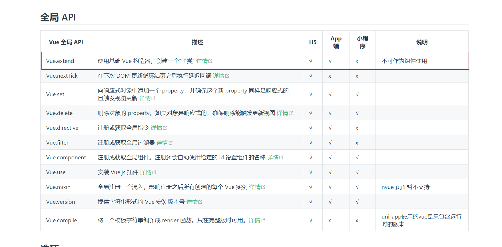
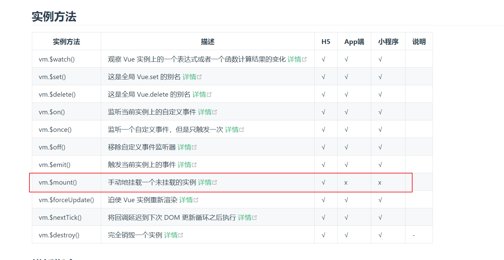
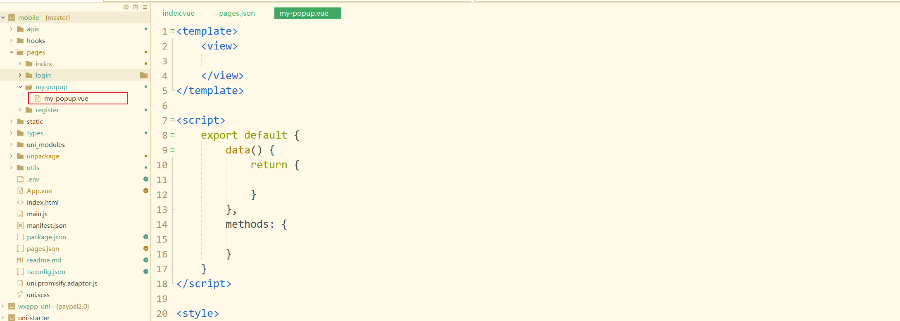

开发公司某个uniapp项目时，有个电商营销的需求，涉及到许多页面公共弹窗，比如在首页存在多个不同的弹窗，需要在不同的时机弹，分类详情页也有多个弹窗、裂变页也要有相同的弹窗等等。项目中原来的做法是写公共组件，然后在需要的页面引入，这种做法既存在很多冗余代码，还会导致弹窗乱弹等等情况。

那既然上面这种做法有缺点，那有更好的办法吗？

那必然有，就是函数式弹窗啦，参照这篇文章[函数式调用弹窗实现(vue版)](../vue/function-component.md)

但是，上方的函数式弹窗只能用在H5上，在app上面用不了，因为在uniapp开发中，Vue.extend不可作为组件使用，并且vm.$mount()在APP当中也无法使用。





那APP当中应该怎么办呢？

别急，当然有办法，那就是页面路由弹窗啦，意思就是把弹窗放进某个空白页面当中，在pages.json中注册，利用uniapp的路由跳转对弹窗进行显示隐藏，就类似于函数式弹窗了。具体实现如下：

1、在pages文件夹下新建一个页面my-popup.vue



2、在pages.json中进行注册（**重点敲黑板**）

```json
{
	"pages": [
		{
			"path": "pages/my-popup/my-popup",
			"style": {
				"navigationBarTitleText": "",
				"navigationStyle": "custom",  //关闭页面头部导航栏
				"app-plus": {
					"background": "transparent", //背景透明
					"popGesture": "none", //ios禁用侧滑返回
					"animationType": "fade-in" //滑动动画
				}
			}
		}
	]
}
```

[具体文档](https://uniapp.dcloud.net.cn/collocation/pages.html#app-plus)

3、弹窗显示隐藏（原理：navigateTo显示弹窗，navigateBack隐藏弹窗）

显示：

```javascript
uni.navigateTo({url: '/pages/my-popup/my-popup'})
```

隐藏：

```vue
<template>
	<view>
		<uni-popup ref="popup" border-radius="10px" background-color="#fff" @change="change">
			<view class="popup">
				弹出Popup
			</view>
		</uni-popup>
	</view>
</template>

<script lang="ts" setup>
	import { onMounted, ref } from 'vue';
	import { UniPopupOnChange } from '@uni-helper/uni-ui-types'
	import { onBackPress } from '@dcloudio/uni-app'
	const popup = ref();
	onMounted(() => {
		popup.value?.open('center')
		uni.showToast({
			title: '弹窗打开'
		})
	})
	onBackPress((e) => {
		if (e.from == "navigateBack") {
			return false
		}
		return true;
	})
	const goBack = () => {
		uni.navigateBack({
			success: () => {
				uni.showToast({
					title: '弹窗关闭'
				})
			}
		})
	}
	const change : UniPopupOnChange = (props) => {
		if (!props.show) {
			goBack()
		}
	}
</script>

<style lang="scss">
    /* 背景透明必须设置page的background为透明，否则为白色*/
	page {
		background: transparent;
	}
</style>
<style lang="scss" scoped>
	.popup {
		height: 200px;
		padding: 0 20px;
		display: flex;
		align-items: center;
		justify-content: center;
	}
</style>
```

最终效果：

<div style="width: 300px"><VidStack  src="/video/uniapp-popup/video.mp4" height="100%" /></div>
