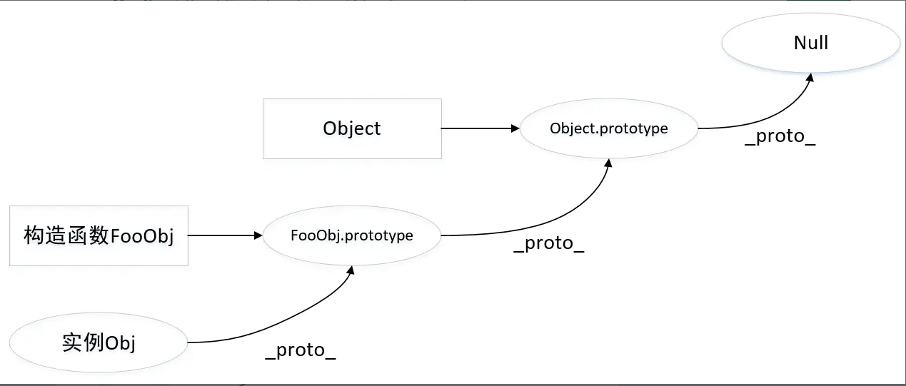
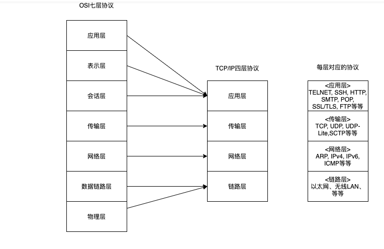
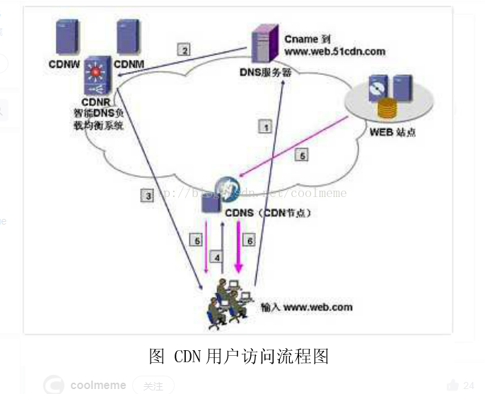
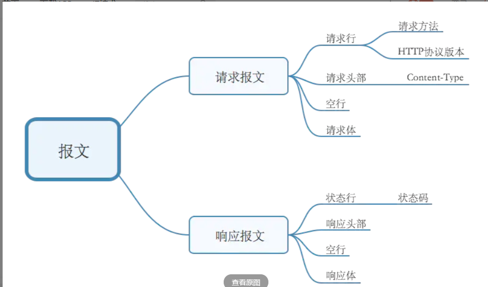
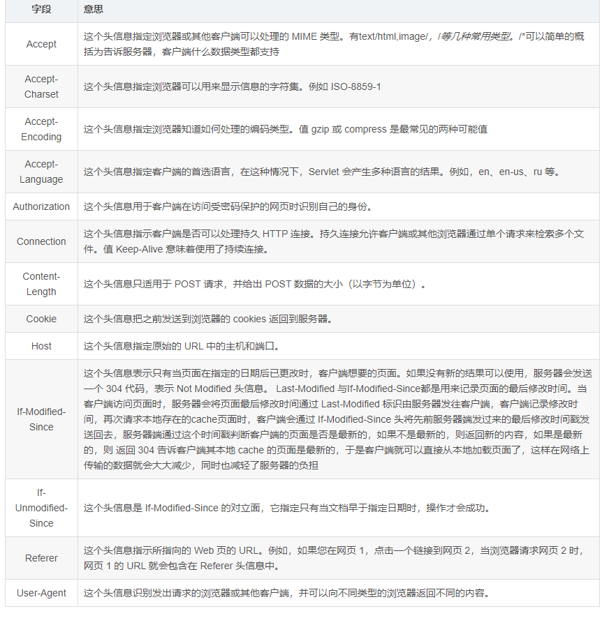

## 一、JavaScript 基础

> 前端工程师吃饭的家伙，深度、广度一样都不能差。

### **变量和类型**

- **1.`JavaScript`规定了几种语言类型**

八种语言类型，其中包括基本数据类型七种：Number，String，Null，Undefined，Boolean，Symbol、BigInt；复杂数据类型 1 种：Object（Array，function 等都是 Object 类型）

- **2.`JavaScript`对象的底层数据结构是什么**

堆和栈

- **3.`Symbol`类型在实际开发中的应用、可手动实现一个简单的 `Symbol`**

应用：

① 常量使用

② 区分不同的属性

③ 对象的私有成员

实现：

```javascript
(function() {
  var root = this;
  var generateName = (function() {
    var postfix = 0;
    return function(descString) {
      postfix++;
      return "@@" + descString + "_" + postfix;
    };
  })();
  var SymbolPolyfill = function Symbol(description) {
    // 实现特性第 2 点：Symbol 函数前不能使用 new 命令
    if (this instanceof SymbolPolyfill)
      throw new TypeError("Symbol is not a constructor");
    // 实现特性第 5 点：如果 Symbol 的参数是一个对象，就会调用该对象的 toString 方法，将其转为字符串，然后才生成一个 Symbol 值。
    var descString =
      description === undefined ? undefined : String(description);
    var symbol = Object.create({
      toString: function() {
        return this.__Name__;
      },
      valueOf: function() {
        return this;
      },
    });
    Object.defineProperties(symbol, {
      __Description__: {
        value: descString,
        writable: false,
        enumerable: false,
        configurable: false,
      },
      __Name__: {
        value: generateName(descString),
        writable: false,
        enumerable: false,
        configurable: false,
      },
    });
    // 实现特性第 6 点，因为调用该方法，返回的是一个新对象，两个对象之间，只要引用不同，就不会相同
    //  Symbol 函数的参数只是表示对当前 Symbol 值的描述，相同参数的 Symbol 函数的返回值是不相等的。
    return symbol;
  };
  var forMap = {};
  Object.defineProperties(SymbolPolyfill, {
    for: {
      value: function(description) {
        var descString =
          description === undefined ? undefined : String(description);
        return forMap[descString]
          ? forMap[descString]
          : (forMap[descString] = SymbolPolyfill(descString));
      },
      writable: true,
      enumerable: false,
      configurable: true,
    },
    keyFor: {
      value: function(symbol) {
        for (var key in forMap) {
          if (forMap[key] === symbol) return key;
        }
      },
      writable: true,
      enumerable: false,
      configurable: true,
    },
  });
  root.SymbolPolyfill = SymbolPolyfill;
})();
```

- **4.`JavaScript`中的变量在内存中的具体存储形式**

基本数据类型存储在栈中，数据内存大小确定，并由系统自动分配和自动释放。这样带来的好处就是，内存可以及时得到回收，相对于堆来说 ，更加容易管理内存空间。

复杂数据类型包括内存指针和实际内存，其内存指针存储在栈中，实际内存存储在堆中，当需要使用复杂类型时，先从栈中找到内存指针，通过指针找到堆中的内存。当我们对复杂数据类型变量进行直接浅拷贝时，拷贝的只是其引用指针。

- **5.基本类型对应的内置对象，以及他们之间的装箱拆箱操作**

基本数据类型的内置对象：Boolean，String，Number

装箱：将基本数据类型转换为引用数据类型，分为隐式装箱和显示装箱

 隐式：每当读取一个基本类型的值时，后台会创建一个该基本类型所对应的对象。在这个基本类型上调用方法，其实是在这个基本类型对象上调用方法。这个基本类型的对象是临时的，它只存在于方法调用那一行代码执行的瞬间，执行方法后立刻被销毁。

```javascript
num.toFixed(2); // '123.00'
//上方代码在后台的真正步骤为
var c = new Number(123);
c.toFixed(2);
c = null;
```

 显式：直接 new 一个内置对象

```javascript
let a = new String("jkj");
```

拆箱：将引用数据类型转换为基本数据类型。两个方法：valueOf()，toString()

- **6.理解值类型和引用类型(同 4)**
- **7.`null`和 `undefined`的区别**

(1)null 表示"没有对象"，即该处不应该有值

 用法：① 作为函数的参数，表示该函数的参数不是对象。

 ② 作为对象原型链的终点。

(2)undefined 表示"缺少值"，就是此处应该有一个值，但是还没有定义

用法：① 变量被声明了，但没有赋值时，就等于 undefined。

 ② 调用函数时，应该提供的参数没有提供，该参数等于 undefined。

 ③ 对象没有赋值的属性，该属性的值为 undefined。

 ④ 函数没有返回值时，默认返回 undefined。

- **8.至少可以说出三种判断 `JavaScript`数据类型的方式，以及他们的优缺点，如何准确的判断数组类型**

（1）instanceOf:主要用于检测引用类型，检测某个实例是否属于某个对象

 缺点：不能检测基本数据类型

```javascript
console.log([] instanceof Array); //true
console.log(123 instanceof Number); //false
```

（2）typeOf():用于检测基本数据类型

 缺点：无法检测引用数据类型

```javascript
console.log(typeof 123); //number
console.log(typeof []); //Object
```

（3）Object.prototype.toString.call():可以检测任何数据类型

 原理：toString()方法在大部分继承 Object 对象上的都存在，只不过已经被改写了,Object 对象上的 toString 方法返回[Object type]，再通过 call 方法改变 this 指向，即可返回被检测数据的类型

```javascript
console.log(Object.prototype.toString); //[object Object]
console.log(Object.prototype.toString.call(123)); //[object Number]
```

（4）准确的判断数组类型：Array.isArray()和 Object.prototype.toString.call()、instanceOf、constructor

```javascript
console.log(a instanceof Array); //true
console.log(Array.isArray(a)); //true
console.log(a.constructor === Array); //true
console.log(Object.prototype.toString.call(a)); //[object Array]
```

- **9.可能发生隐式类型转换的场景以及转换原则，应如何避免或巧妙应用**

（1）自动转换 Boolean：if (表达式){}

（2）运算符

 在非 Numeber 类型进行数学运算符 - \* / 时，会先将非 Number 转换成 Number 类型。

 `+` 运算符要考虑字符串的情况，在操作数中存在字符串时，优先转换成字符串，
 `+` 运算符其中一个操作数是字符串的话，会进行连接字符串的操作。

`+` 运算符其中一个操作数是对象类型的话，会调用对象类型的toString方法进行转换。

```javascript
console.log(1 + null, 1 + "12", 1 + undefined, 1 + ["12"], 1 + { a: 1 }); //1 112 NaN 112 1[object Object]
```

- **10.出现小数精度丢失的原因，`JavaScript`可以存储的最大数字、最大安全数字，`JavaScript`处理大数字的方法、避免精度丢失的方法**

出现小数精度丢失的原因：

 由于 JavaScript 采用 IEEE 754 标准，数值存储为 64 位双精度格式，数值精度最多可以达到 53 个二进制位（1 个隐藏位与 52 个有效位）。如果数值的精度超过这个限度，第 54 位及后面的位就会被丢弃，所以在相加的时候会因为小数位的限制而将二进制数字截断。（ 小数相加前会将各自转换为二进制形式 ）

最大数字：Number.MAX_VALUE（1.7976931348623157e+308）

最大安全数字：Number.MAX_SAFE_INTEGER（9007199254740991）

解决精度丢失的方法：

① 原生利用 toFixed()方法保留小数

② 利用第三方库解决。比如 [bignumber.js](https://github.com/MikeMcl/bignumber.js)，[decimal.js](https://github.com/MikeMcl/decimal.js)，以及[big.js](https://github.com/MikeMcl/big.js)等

### **原型和原型链**

- **1.理解原型设计模式以及 `JavaScript`中的原型规则**

原型模式：是一种创建型设计模式，Prototype模式允许一个对象再创建另外一个可定制的对象，根本无需知道任何如何创建的细节,工作原理是:通过将一个原型对象传给那个要发动创建的对象，这个要发动创建的对象通过请求原型对象拷贝它们自己来实施创建。

javaScript中的原型规则：

①所有引用类型都有一个_ptoto_（隐式原型）属性，该属性值是一个对象。

②所有函数都有一个prototype（显示原型）属性，该属性是一个对象。

③所有引用类型的_proto_属性指向其构造函数的prototype属性。

④当在寻找一个对象上的属性时，先从对象本身身上找，再从该对象的_proto_（即构造函数上的prototype的属性）属性上找。

原型链：



- 2.`instanceof`的底层实现原理，手动实现一个 `instanceof`

原理：利用原型链来实现判断继承关系。

底层代码实现：

```javascript
function myInstanceOf(L, R) {
  const O = R.prototype;
  L = L.__proto__;
  while (1) {
    if (L === null) return false;
    if (L === O) return true;
    L = L.__proto__;
  }
}
```

- 4.实现继承的几种方式以及他们的优缺点

（1）原型链继承：利用原型链的指向实现

```javascript
function person() {
  this.name = "111";
}
function xie() {}
let a = new person();
xie.prototype = a;

console.log(person.prototype == xie.prototype.__proto__); //true
```

缺点：①原型中的包含所有引用值会被所有实例间共享；

②子类实例化的时候不能给父类构造函数传参

（2）构造函数继承：利用call或者apply方法在子类构造函数中调用父类构造函数（改变this指向）

function person(age) {
  this.age = age;
  this.name = "111";
}
function xie(age) {
  person.call(this, age);
}
let b = new xie(112);
console.log(b.name); //111

缺点：不能使用父类原型上的方法。

（3）组合继承：结合原型链继承和构造函数继承，使用比较多

```javascript
function person(age) {
  this.age = age;
  this.name = "111";
}
person.prototype.med = function () {
  console.log(111);
};
function xie(age) {
  person.call(this, age);
  this.age = 115;
}
xie.prototype = new person();
let b = new xie(112);
b.med();  //111
```

缺点：父类构造函数会被调用两次（一次在子类构造函数，一次在原型指向）

（4）寄生式继承：创建一个实现继承的函数，以某种方式增强对象，并返回这个对象。

```javascript
function create(obj) {
  let clone = Object(obj);
  clone.sayhi = function () {
    console.log("222");
  };
  return clone;
}
let person = {
  name: 333,
};
let another = create(person);
another.sayhi();
```

缺点：和构造函数继承的缺点一样

（5）寄生组合继承：结合组合继承和寄生继承，去除组合继承调用两次父类构造函数的缺点

```javascript
function person(age) {
  this.age = age;
  this.name = "111";
}
person.prototype.med = function () {
  console.log(111);
};
function person(age) {
  this.age = age;
  this.name = "111";
}
person.prototype.med = function () {
  console.log(111);
};
function inheritPrototype(subType, superType) {
  let prototype = Object(superType.prototype); //创建对象
  prototype.constructor = subType; //增强对象
  subType.prototype = prototype; //赋值对象
}
function xie(age) {
  person.call(this, age);
  this.age = 115;
}
inheritPrototype(xie, person); //这一步节省调用父类构造函数
let c = new xie();
c.med(); //111
```

（6）class关键字：extends单继承，super()方法向父类传递参数。最好用

- 5.可以描述 `new`一个对象的详细过程，手动实现一个 `new`操作符

```javascript
function myNew(con, ...rest) {
  let obj = {};
  obj.__proto__ = con.prototype;
  let result = con.apply(obj, rest);
  return result instanceof Object ? result : obj;
}

function person(age) {
  this.age = age;
}
let xie1 = new person(113);
let xie = myNew(person, 112);
console.log(xie);  //person { age: 112 }
console.log(xie1);// person { age: 113 }
```

### 作用域和闭包

- **1.理解词法作用域和动态作用域**

词法作用域：代码编译时候的作用域

动态作用域：代码运行时候的作用域

- **2.理解 `JavaScript`的作用域和作用域链**

作用域（词法作用域）：全局作用域、函数作用域、块级作用域

作用域链：代码执行时，会寻找变量和函数的标识符，会沿作用域链逐级寻找。寻找路径：目前的上下文—>寻找上一级的上下文—>.....全局上下文。这就是作用域链

- **3.理解 `JavaScript`的执行上下文栈，可以应用堆栈信息快速定位问题**

执行上下文：当前JavaScript代码被解析和执行时所在环境的抽象概念，JavaScript中运行任何的代码都是在执行上下文中运行。

- **4.`this`在几种不同使用场景的取值**

①全局作用域下this指向window（node环境下指向{}，和global无关）

②函数作用域下，this指向调用这个函数的上下文对象

③在对象中，this指向该对象本身

④调用构造函数，this指向构造函数实例化后的新对象

⑤apply、bind和call调用时，this指向参数中的对象

⑥匿名函数（函数表达式）调用，指向的是全局对象（只能是window，node环境下是undefined）

- **5.闭包的实现原理和作用，可以列举几个开发中闭包的实际应用**

闭包的实现原理：利用作用域链，在一个函数中引用另一个函数的变量，通常是嵌套函数

作用：使用函数内部的变量

应用：①防抖、节流

```javascript
 /*防抖*/
 function debounce(fn) {
            let da = null;
            return function() {
                clearTimeout(da);
                da = setTimeout(() => {
                    fn.call(this, arguments) 
                }, 1000);
              
            }
        }
/*节流*/
 function throttle(fn) {
            // 4、通过闭包保存一个标记
            let canRun = true;
            return function() {
                // 5、在函数开头判断标志是否为 true，不为 true 则中断函数
                if (!canRun) {
                    return;
                }
                // 6、将 canRun 设置为 false，防止执行之前再被执行
                canRun = false;
                // 7、定时器
                setTimeout(() => {
                    fn.call(this, arguments);
                    // 8、执行完事件（比如调用完接口）之后，重新将这个标志设置为 true
                    canRun = true;
                }, 1000);
            };
        }
```

②函数柯里化：实现参数复用

```javascript
function a() {
  let text = 1
  return function b(name) {
    console.log(text, name)
  }
}
a()(2) //1 2
```

- **6.理解堆栈溢出和内存泄漏的原理，如何防止**

栈堆溢出：栈堆调用次数超量（一般存在于递归操作）

内存泄漏：程序被分配的栈内有一块内存既不能使用，也不能被回收（一般存在于闭包、全局变量中）

解决办法：①对使用完的对象置为null

②合理使用闭包，不过多使用

- **7.如何处理循环的异步操作**

利用异步函数：async和await

- **8.理解模块化解决的实际问题，可列举几个模块化方案并理解其中原理**

（1）commonJS：只能在服务端使用

定义模块：module.exports=对象；加载：require()

（2）AMD：服务端和浏览器端均可使用，推崇依赖前置（在定义模块的时候就要声明其依赖的模块）

定义模块：define(id,dependencies,factory)

- ——id 可选参数，用来定义模块的标识，如果没有提供该参数，脚本文件名（去掉拓展名）
- ——dependencies 是一个当前模块用来的模块名称数组
- ——factory 工厂方法，模块初始化要执行的函数或对象，如果为函数，它应该只被执行一次，如果是对象，此对象应该为模块的输出值。

加载：require([dependencies], ``function``(){});

- ——第一个参数是一个数组，表示所依赖的模块；
- ——第二个参数是一个回调函数，当前面指定的模块都加载成功后，它将被调用。加载的模块会以参数形式传入该函数，从而在回调函数内部就可以使用这些模块

（3）CMD：服务端和浏览器端均可使用，推崇依赖就近（**只有在用到某个模块的时候再去require——按需加载**）

定义模块：define(**function**(require,exports,module){}）

加载：利用sea.js的use方法

（4）es6模块化

定义模块：①export default 默认导出  ②export 单独导出

加载：import '...' from '...'。

### 执行机制

- **1.为何 `try`里面放 `return`，`finally`还会执行，理解其内部机制**

先执行try里面的语句，如果try里面抛出异常，就执行catch里面的语句，finally里面的语句最终都会执行

- **2.`JavaScript`如何实现异步编程，可以详细描述 `EventLoop`机制**

异步编程实现：

①回调函数。容易导致回调地狱

②利用promise实现异步。无法取消改变状态

③生成器Generators/ yield。可以利用yield控制函数的执行

④利用异步函数async/await（基于promise和生成器实现）。非常好用

`EventLoop`机制：javascript是单线程，执行任务分为同步任务和异步任务，异步任务又分为宏任务和微任务。

执行顺序：同步任务—>微任务—>宏任务

- **3.宏任务和微任务分别有哪些**

宏任务：script(整体代码), setTimeout, setInterval, setImmediate（非标准，减少使用）, I/O, UI rendering。

微任务：promise（本身同步）、 Object.observe（观察对象变化，实现数据监听）、 MutationObserver（观察dom变化）

- **4.可以快速分析一个复杂的异步嵌套逻辑，并掌握分析方法**
- **5.使用 `Promise`实现串行**

①利用reduce

```javascript
const serialPromises = function (promises) {
  promises.reduce((prev, next) => prev.then((preVal) => next(preVal)), Promise.resolve());
```

②利用async/await

- **6.`Node`与浏览器 `EventLoop`的差异**
- **7.如何在保证页面运行流畅的情况下处理海量数据**

### 语法和 API

- **1.理解 `ECMAScript`和 `JavaScript`的关系**

`ECMAScript`是 `JavaScript`的一部分，是执行标准。

- **2.熟练运用 `es5`、`es6`提供的语法规范，**
- **3.熟练掌握 `JavaScript`提供的全局对象（例如 `Date`、`Math`）、全局函数（例如 `decodeURI`、`isNaN`）、全局属性（例如 `Infinity`、`undefined`）**
- **4.熟练应用 `map`、`reduce`、`filter` 等高阶函数解决问题**
- **5.`setInterval`需要注意的点，使用 `settimeout`实现 `setInterval`**
- **6.`JavaScript`提供的正则表达式 `API`、可以使用正则表达式（邮箱校验、`URL`解析、去重等）解决常见问题**
- **7.`JavaScript`异常处理的方式，统一的异常处理方案**

利用try、catch、finally

## 二、HTML 和 CSS

### HTML

- **1.从规范的角度理解 `HTML`，从分类和语义的角度使用标签**
- **2.常用页面标签的默认样式、自带属性、不同浏览器的差异、处理浏览器兼容问题的方式**
- **3.元信息类标签(`head`、`title`、`meta`)的使用目的和配置方法**
- **4.`HTML5`离线缓存原理**

使用：头部html标签加上manifest = "cache.manifest"

cache.manifest文件构成：

（1）CACHE:表示需要离线存储的资源列表，由于包含manifest文件的页面将被自动离线存储，所以不需要把页面自身也列出来。

（2）NETWORK:表示在它下面列出来的资源只有在在线的情况下才能访问，他们不会被离线存储，所以在离线情况下无法使用这些资源。不过，如果在CACHE和NETWORK中有一个相同的资源，那么这个资源还是会被离线存储，也就是说CACHE的优先级更高。

（3）FALLBACK:表示如果访问第一个资源失败，那么就使用第二个资源来替换他，比如上面这个文件表示的就是如果访问根目录下任何一个资源失败了，那么就去访问offline.html。

- **5.可以使用 `Canvas API`、`SVG`等绘制高性能的动画**

### CSS

- **1.`CSS`盒模型，在不同浏览器的差异**

标准盒模型：box-sizing:content-box(盒子的宽和不包括pading和border)

ie盒模型：box-sizing:border-box(盒子的宽和高包括pading和border)

- **2.`CSS`所有选择器及其优先级、使用场景，哪些可以继承，如何运用 `at`规则**

at（@）规则：

```css
/*定义字符集*/
@charset "utf-8"
/*导入css文件*/
@import "base.css"
/*自定义字体*/
@font-face {}
/*声明CSS3 animation动画关键帧*/
@keyframes fadeIn {}
/*媒体查询*/
@media{}
```

- **3.`CSS`伪类和伪元素有哪些，它们的区别和实际应用**

伪元素：::after、::before、::first-line、::first-letter等

伪类：:hover、:first-child、:last-child、:link、focus、:visited等

- **4.`HTML`文档流的排版规则，`CSS`几种定位的规则、定位参照物、对文档流的影响，如何选择最好的定位方式，雪碧图实现原理**

雪碧图(精灵图)：**CSS Sprites**，利用对应的 `background-position`来展现不同位置的图标。

- **5.水平垂直居中的方案、可以实现 `6`种以上并对比它们的优缺点**

**已知宽高**

①利用定位

```css
.parent {
      position: relative;
      background-color: black;
      width: 500px;
      height: 500px;
    }
    .child {
      position: absolute;
      width: 200px;
      height: 200px;
      left: 0;
      right: 0;
      top: 0;
      bottom: 0;
      margin: auto;
      background-color: blanchedalmond;
    }
```

②利用定位和边距

```css
    .parent {
      position: relative;
      background-color: black;
      width: 500px;
      height: 500px;
    }
    .child {
      position: absolute;
      width: 200px;
      height: 200px;
      left: 50%;
      top: 50%;
      margin: -100px 0 0 -100px;
      background-color: blanchedalmond;
    }
```

**未知宽高**

①利用定位和2D平移

```css
.parent {
      position: relative;
      background-color: black;
      width: 500px;
      height: 500px;
    }
    .child {
      position: absolute;
      width: 200px;
      height: 200px;
      left: 50%;
      top: 50%;
      transform: translate(-50%, -50%);
      background-color: blanchedalmond;
    }
```

②flex布局

```css
.parent {
      display: flex;
      align-items: center;
      justify-content: center;
      background-color: black;
      width: 500px;
      height: 500px;
    }
    .child {
      width: 200px;
      height: 200px;

      background-color: blanchedalmond;
    }
```

③网格布局

```css
.parent {
      display: grid;
      background-color: black;
      width: 500px;
      height: 500px;
    }
    .child {
      align-self: center;
      justify-self: center;
      width: 200px;
      height: 200px;

      background-color: blanchedalmond;
    }
```

④文字水平居中（需要知道高度）

```css
.div {
      width: 200px;
      height: 200px;
      text-align: center;
      line-height: 200px;
      background-color: blanchedalmond;
    }
```

- **6.`BFC`实现原理，可以解决的问题，如何创建 `BFC`**

BFC：块级格式化上下文。BFC中的内容不会影响到外面的盒子

如何创建：

①body 根元素
②浮动元素：float 除 none 以外的值
③绝对定位元素：position (absolute、fixed)
④display 为 inline-block、table-cells、flex
⑤overflow 除了 visible 以外的值 (hidden、auto、scroll)

应用：

①解决外边距塌陷

② BFC 可以包含浮动的元素（清除浮动）

③BFC 可以阻止元素被浮动元素覆盖

- **7.可使用 `CSS`函数复用代码，实现特殊效果**
- **8.`PostCSS`、`Sass`、`Less`的异同，以及使用配置，至少掌握一种**
- **9.`CSS`模块化方案、如何配置按需加载、如何防止 `CSS`阻塞渲染**

scoped

- **10.熟练使用 `CSS`实现常见动画，如渐变、移动、旋转、缩放等等**
- **11.`CSS`浏览器兼容性写法，了解不同 `API`在不同浏览器下的兼容性情况**
- **12.掌握一套完整的响应式布局方案**

### 手写

- 1.**手写图片瀑布流效果**

利用flex布局

```html
<div class="masonry">
    <!-- 第一列 -->
    <div class="column">
        <div class="item"></div>
        <!-- more items-->
    </div>
    <!-- 第二列 -->
    <div class="column">
        <div class="item"></div>
        <!-- more items-->
    </div>
    <!-- 第三列 -->
    <div class="column">
        <div class="item"></div>
        <!-- more items-->
    </div>
</div>
<style>
.masonry {
    display: flex; // 设置为Flex容器
    flex-direction: row; // 主轴方向设置为水平方向
}

.column {
    display: flex; // 设置为Flex容器
    flex-direction: column; // 主轴方向设置为垂直方向
}
</style>
<javascript>
  
    /*伪代码
    可以利用原生js动态创建img节点添加到相应的dom节点下
    */
  
    let data1 = [], //第一列
    data2 = [], //第二列
    data3 = [], //第三列
    i = 0;
while (i < data.length) {
    data1.push(data[i++]);
    if (i < data.length) {
        data2.push(data[i++]);
    }
    if (i < data.length) {
        data3.push(data[i++]);
    }
}
return {
    //第一列
    data1,
    //第二列
    data2,
    //第三列
    data3
};

</javascript>

```

- **2.使用 `CSS`绘制几何图形（圆形、三角形、扇形、菱形等）**

①圆形：

```css
width：100px;
height:100px;
border-radius: 50%;
```

②三角形：

```html
 <style>
      .triangle1-wrap {
        width: 50px;
        height: 50px;
        overflow: hidden;
      }
      .triangle1 {
        width: 50px;
        height: 50px;
        background-color: red;
        transform: rotateZ(45deg);
        margin-top: 35px;
      }
    </style>
    <div class="triangle1-wrap">
      <div class="triangle1"></div>
    </div>

//利用border
 <style>
 .triangle2{
        width:0px;
        height:0px;
        border-top:solid 50px red;
        border-bottom:solid 50px transparent;
        border-left:solid 50px transparent;
        border-right:solid 50px transparent;
    }
</style>
```

③扇形

```html
 <style>
.pie {
	position: relative;
	margin: 1em auto;
	padding: 0;
	width: 32em;
  height: 32em;
	border-radius: 50%;
	list-style: none;
  overflow: hidden;
}
.slice {
	overflow: hidden;
	position: absolute;
	top: 0; 
  right: 0;
	width: 50%;
  height: 50%;
	transform-origin: 0% 100%; //变形定位原点
}
.slice-one {
  transform: rotate(30deg) skewY(-30deg);
  background: black;
}
.slice-two {
  transform: rotate(-30deg) skewY(-30deg);
  background: yellow;
}
.slice-three {
  transform: rotate(-90deg) skewY(-30deg);
  background: black;
}
.slice-four {
  transform: rotate(-150deg) skewY(-30deg);
  background: yellow;
}
.slice-five {
  transform: rotate(-210deg) skewY(-30deg);
  background: black;
}
.slice-six {
  transform: rotate(-270deg) skewY(-30deg);
  background: yellow;
}
 
  </style>
 
<ul class='pie'>
    <li class='slice-one slice'> </li> 
    <li class='slice-two slice'> </li>
    <li class='slice-three slice'> </li>
    <li class='slice-four slice'> </li>
    <li class='slice-five slice'> </li>
    <li class='slice-six slice'> </li>
  <ul>
// skew()进行拉伸
```

④菱形

```
利用transform: skew()和transform-origin: 0% 100%; 
```

- **3.使用纯 `CSS`实现曲线运动（贝塞尔曲线）**
- **4.实现常用布局（三栏、圣杯、双飞翼、吸顶），可是说出多种方式并理解其优缺点**

①三栏布局

```html
<!DOCTYPE html>
<html lang="en">
  <head>
    <meta charset="UTF-8" />
    <meta http-equiv="X-UA-Compatible" content="IE=edge" />
    <meta name="viewport" content="width=device-width, initial-scale=1.0" />
    <title>Document</title>
  </head>
  <style>
    body,
    html {
      width: 100%;
      height: 100%;
    }
    .box {
      height: 200px;
      width: 100%;
    }
    .right {
      float: right;
      width: 200px;
      height: 200px;
      background-color: #ccc;
    }
    .center {
      height: 200px;
      background-color: #000;
      overflow: hidden;
    }
    .left {
      float: left;
      width: 200px;
      height: 200px;
      background-color: #ddd;
    }
  </style>
  <body>
    <div class="box">
      <div class="left"></div>
      <div class="right"></div>
      <div class="center"></div>
    </div>
  </body>
</html>
//注意：该方法盒子的位置非常重要，中间自适应的盒子必须放到最后
```

其余利用flex、浮动（float)和position定位都可以轻松实现

## 三、计算机基础

> 关于编译原理，不需要理解非常深入，但是最基本的原理和概念一定要懂，这对于学习一门编程语言非常重要

### 编译原理

- **1.理解代码到底是什么，计算机如何将代码转换为可以运行的目标程序**
- **2.正则表达式的匹配原理和性能优化**
- **3.如何将 `JavaScript`代码解析成抽象语法树(`AST`)**
- **4.`base64`的编码原理**
- **5.几种进制的相互转换计算方法，在 `JavaScript`中如何表示和转换**

### 网络协议

- **1.理解什么是协议，了解 `TCP/IP`网络协议族的构成，每层协议在应用程序中发挥的作用**



- **2.三次握手和四次挥手详细原理，为什么要使用这种机制**
- **3.有哪些协议是可靠，`TCP`有哪些手段保证可靠交付**

基于TCP的协议都是可靠传输，例如FTP(文件传输协议)、SMTP(简单邮件传输协议)

手段：①确认ACK、②超时重传、③采用流量控制（滑动窗口方法）

- **4.`DNS`的作用、`DNS`解析的详细过程，`DNS`优化原理**

**作用**：将域名转换为ip地址，让客户端和服务器进行连接，这个过程称为DNS域名解析。

**过程**：①主机向本地DNS服务器查询（一般采用递归查询）。

②本地DNS服务器向根域名服务器查询（一般采用迭代查询）。

递归查询：主机向本地DNS服务器查询ip的过程中，本地DNS服务器通过递归，只会向主机返回ip地址或者未查询到的信息。

迭代查询：本地DNS服务向根DNS服务器查询过程中，根DNS会向本地DNS服务器返回ip地址或者返回本地域名服务服务器下一步需要访问哪个DNS服务器的指示。

优化原理：采用高度缓存的策略，存放最近查询过的域名以及从何处获得域名映射信息的记录。

- 5.**`CDN`的作用和原理**

CDN：内容分发网络

作用：①提升用户访问网站的速度，提升用户体验

②降低网站服务器请求的压力

原理：在用户和服务器之间增加Cache层，主要是通过接管DNS实现，将用户的请求引导到Cache上获得源服务器的数据，从而降低网络的访问时间。

过程：本地DNS域名服务器找到从根域名（或者授权域名）DNS服务器域名记录后，向智能调度DNS查询域名的ip地址，智能调度DNS 根据一定的算法和策略(比如静态拓扑，容量等),将最适合的CDN节点ip地址回应给本地DNS服务器。



- **6.`HTTP`请求报文和响应报文的具体组成，能理解常见请求头的含义，有几种请求方式，区别是什么**



常见请求头：



请求方法：get、post、option、head、put、delete、connect

- 7.`HTTP`所有状态码的具体含义，看到异常状态码能快速定位问题

常见：200（请求成功）、301（网站永久重定向）、302（网站临时重定向）、304（资源未更新、使用缓存）、403（禁止访问）、404（资源不存在）、502（服务器无法响应）

5xx：一般错误存在于服务器中。

其他的错误一般存在于客户端中。

- **8.`HTTP1.1`、`HTTP2.0`带来的改变**

HTTP1.1：

①**增加缓存策略**。如：Entity tag、If-Unmodified-Since、If-Match、If-None-Match等更多可供选择的缓存头来控制缓存策略。

②**优化带宽和网络链接的使用**。在HTTP1.0中存在一些浪费带宽的现象，例如客户端只是需要某个对象的一部分，而服务器却将整个对象送过来了，并且不支持断点续传的功能；HTTP1.1则在请求头引入了range头域，它允许只请求资源的某个部分，即返回码是206（Partial Content），这样就方便了开发者自由的选择以便于充分利用带宽和连接。

③**错误通知的管理**。HTTP1.1中新增了**24个错误状态响应码**，如：409（Conflict）表示请求的资源与资源的当前状态发生冲突；410（Gone）表示服务器上的某个资源被永久性的删除。

④**Host头处理**。在HTTP1.0中认为每台服务器都绑定唯一的IP地址，因此请求消息中的URL并没有传递主机名（hostname）。但是随着虚拟主机技术的发展，在一台物理服务器上可以存在多个虚拟主机（Multi-homed Web Servers），并且它们共享一个IP地址；在HTTP1.1的请求消息和响应消息都应支持host头域，且请求消息中如果没有host头域会报告一个错误（400 Bad Request）。简而言之就是一台服务器上可以利用host放多个网站。

⑤**长连接**。HTTP1.1支持长连接（PersistentConnection）和请求的流水线（Pipelining）处理，在一个TCP连接上可以传送多个HTTP请求和响应，减少了建立连接和关闭连接的消耗和延迟；在HTTP1.1中默认开启了connection：keep-alive，一定程度上弥补了HTTP1.0每次请求都要创建连接的缺点。

http2.0：

①**新的二进制格式**。HTTP1.x的解析是基于文本。基于文本协议的格式解析存在天然缺陷，文本的表现形式有多样性，要做到健壮性考虑的场景必然很多，二进制则不同，只认0和1的组合。基于这种考虑HTTP2.0的协议解析决定采用二进制格式，实现方便且健壮。

②**Header头部压缩**。如上文中所言，对前面提到过HTTP1.x的header带有大量信息，而且每次都要重复发送，HTTP2.0使用encoder来减少需要传输的header大小，通讯双方各自cache一份header fields表，既避免了重复header的传输，又减小了需要传输的大小。

**③服务端推送**。http2.0支持服务端可以将没有传输完的数据主动传输到客户端。

**④多路复用**。即连接共享，即每一个request都是用作连接共享机制的。一个request对应一个id，这样一个连接上可以有多个request，每个连接的request可以随机的混杂在一起，接收方可以根据request的id将request再归属到各自不同的服务端请求里面。

- **9.`HTTPS`的加密原理，如何开启 `HTTPS`，如何劫持 `HTTPS`请求**
- **10.理解 `WebSocket`协议的底层原理、与 `HTTP`的区别**

全双工通信，服务端可以主动推送资源到客户端，主要用于实时数据的展示

### 设计模式

- **1.熟练使用前端常用的设计模式编写代码，如单例模式、装饰器模式、代理模式等**
- **2.发布订阅模式和观察者模式的异同以及实际应用**
- **3.可以说出几种设计模式在开发中的实际应用，理解框架源码中对设计模式的应用**

## 四、数据结构和算法

> 据我了解的大部分前端对这部分知识有些欠缺，甚至抵触，但是，如果突破更高的天花板，这部分知识是必不可少的，而且我亲身经历——非常有用！

### JavaScript 编码能力

- 1.多种方式实现数组去重、扁平化、对比优缺点

去重：

```javascript
//改变自身
function outRepeat1(arr) {
  for (let i = 0; i < arr.length; i++) {
    for (let j = i + 1; j < arr.length; j++) {
      if (arr[i] === arr[j]) {
        arr.splice(j, 1)
        j-- //防止跳过元素
      }
    }
  }
  return arr
}


//重新赋值数组
function outRepeat2(arr) {
  let result = []
  for (let i = 0; i < arr.length; i++) {
    if (result.indexOf(arr[i]) === -1) {
      result.push(arr[i])
    }
  }
  return result
}

```

扁平化：

```javascript
function flatDeep1(arr) {
  let result = []
  for (let i = 0; i < arr.length; i++) {
    if (Array.isArray(arr[i])) {
      result = result.concat(flatDeep(arr[i]))
    } else {
      result.push(arr[i])
    }
  }
  return result
}
function flatDeep2(arr) {
  return arr.reduce(function (pre, next) {
    if (Array.isArray(next)) {
      return pre.concat(flatDeep(next))
    } else {
      return pre.concat(next)
    }
  }, [])
}
//第三种，利用flat方法
```

- 2.多种方式实现深拷贝、对比优缺点

```javascript
 function deepCopy(target) {
            let newTar = target instanceof Array ? [] : {}
            if (target && typeof(target) == 'object') {
                for (let item in target) {
                    if (newTar.hasOwnProperty(item)) {
                        newTar[item] = deepCopy(target[item])
                    } else {
                        newTar[item] = target[item];
                    }
                }
            }
            return newTar;
        }
```

- 3.手写函数柯里化工具函数、并理解其应用场景和优势
- 4.手写防抖和节流工具函数、并理解其内部原理和应用场景
- 5.实现一个 `sleep`函数

### 手动实现前端轮子

- 1.手动实现 `call、apply、bind`
- 2.手动实现符合 `Promise/A+`规范的 `Promise`、手动实现 `async await`
- 3.手写一个 `EventEmitter`实现事件发布、订阅

```JavaScript
// 发布订阅模式
class EventEmitter {
  constructor() {
    // 事件对象，存放订阅的名字和事件  如:  { click: [ handle1, handle2 ]  }
    this.events = {}
  }
  // 订阅事件的方法
  on(eventName, callback) {
    if (!this.events[eventName]) {
      // 一个名字可以订阅多个事件函数
      this.events[eventName] = [callback]
    } else {
      // 存在则push到指定数组的尾部保存
      this.events[eventName].push(callback)
    }
  }
  // 触发事件的方法
  emit(eventName, ...rest) {
    // 遍历执行所有订阅的事件
    this.events[eventName] &&
      this.events[eventName].forEach(f => f.apply(this, rest))
  }
  // 移除订阅事件
  remove(eventName, callback) {
    if (this.events[eventName]) {
      this.events[eventName] = this.events[eventName].filter(f => f != callback)
    }
  }
  // 只执行一次订阅的事件，然后移除
  once(eventName, callback) {
    // 绑定的时fn, 执行的时候会触发fn函数
    const fn = (...rest) => {
      callback.apply(this, rest) // fn函数中调用原有的callback
      this.remove(eventName, fn) // 删除fn, 再次执行的时候之后执行一次
    }
    this.on(eventName, fn)
  }
}

```

- 4.可以说出两种实现双向绑定的方案、可以手动实现

```JavaScript
const person = {}
Object.defineProperty(person, 'name', {
    get: function() {
        console.log('获取到name了')
    },
    set: function(val) {
        console.log('设置了name为' + val)
    }
})
person.name  //获取到name了
person.name = '小谢'  //设置了name为小谢
```

- **5.手写 `JSON.stringify`、`JSON.parse`**

用这个函数实现深拷贝缺点：如果拷贝对象属性有fun、undefind、正则、数组对象等，内容会丢失

- 6.**手写一个模版引擎，并能解释其中原理**

利用正则表达式可以实现

- 7.手写 `懒加载`、`下拉刷新`、`上拉加载`、`预加载`等效果

### 数据结构

- 1.理解常见数据结构的特点，以及他们在不同场景下使用的优缺点
- 2.理解 `数组`、`字符串`的存储原理，并熟练应用他们解决问题
- 3.理解 `二叉树`、`栈`、`队列`、`哈希表`的基本结构和特点，并可以应用它解决问题
- 4.了解 `图`、`堆`的基本结构和使用场景

### 算法

- 1.可计算一个算法的时间复杂度和空间复杂度，可估计业务逻辑代码的耗时和内存消耗
- 2.至少理解五种排序算法的实现原理、应用场景、优缺点，可快速说出时间、空间复杂度
- 3.了解递归和循环的优缺点、应用场景、并可在开发中熟练应用
- 4.可应用 `回溯算法`、`贪心算法`、`分治算法`、`动态规划`等解决复杂问题
- 5.前端处理海量数据的算法方案

## 五、运行环境

我们需要理清语言和环境的关系：

> `ECMAScript`描述了 `JavaScript`语言的语法和基本对象规范

> 浏览器作为 `JavaScript`的一种运行环境，为它提供了：文档对象模型（`DOM`），描述处理网页内容的方法和接口、浏览器对象模型（`BOM`），描述与浏览器进行交互的方法和接口

> Node 也是 `JavaScript`的一种运行环境，为它提供了操作 `I/O`、网络等 `API`

### 浏览器 API

- 1.浏览器提供的符合 `W3C`标准的 `DOM`操作 `API`、浏览器差异、兼容性
- 2.浏览器提供的浏览器对象模型 (`BOM`)提供的所有全局 `API`、浏览器差异、兼容性
- 3.大量 `DOM`操作、海量数据的性能优化(合并操作、`Diff`、`requestAnimationFrame`等)
- 4.浏览器海量数据存储、操作性能优化
- 5.`DOM`事件流的具体实现机制、不同浏览器的差异、事件代理
- 6.前端发起网络请求的几种方式及其底层实现、可以手写原生 `ajax`、`fetch`、可以熟练使用第三方库
- 7.浏览器的同源策略，如何避免同源策略，几种方式的异同点以及如何选型
- 8.浏览器提供的几种存储机制、优缺点、开发中正确的选择
- 9.浏览器跨标签通信

### 浏览器原理

- 1.各浏览器使用的 `JavaScript`引擎以及它们的异同点、如何在代码中进行区分
- 2.请求数据到请求结束与服务器进行了几次交互
- 3.可详细描述浏览器从输入 `URL`到页面展现的详细过程
- 4.浏览器解析 `HTML`代码的原理，以及构建 `DOM`树的流程
- 5.浏览器如何解析 `CSS`规则，并将其应用到 `DOM`树上
- 6.浏览器如何将解析好的带有样式的 `DOM`树进行绘制
- 7.浏览器的运行机制，如何配置资源异步同步加载
- 8.浏览器回流与重绘的底层原理，引发原因，如何有效避免
- 9.浏览器的垃圾回收机制，如何避免内存泄漏
- 10.浏览器采用的缓存方案，如何选择和控制合适的缓存方案

### Node

- 1.理解 `Node`在应用程序中的作用，可以使用 `Node`搭建前端运行环境、使用 `Node`操作文件、操作数据库等等
- 2.掌握一种 `Node`开发框架，如 `Express`，`Express`和 `Koa`的区别
- 3.熟练使用 `Node`提供的 `API`如 `Path`、`Http`、`Child Process`等并理解其实现原理
- 4.`Node`的底层运行原理、和浏览器的异同
- 5.`Node`事件驱动、非阻塞机制的实现原理

## 六、框架和类库

> 轮子层出不穷，从原理上理解才是正道

### TypeScript

- 1.理解 `泛型`、`接口`等面向对象的相关概念，`TypeScript`对面向对象理念的实现
- 2.理解使用 `TypeScript`的好处，掌握 `TypeScript`基础语法
- 3.`TypeScript`的规则检测原理
- 4.可以在 `React`、`Vue`等框架中使用 `TypeScript`进行开发

### React

- 1.`React`和 `vue`选型和优缺点、核心架构的区别
- 2.`React`中 `setState`的执行机制，如何有效的管理状态
- 3.`React`的事件底层实现机制
- 4.`React`的虚拟 `DOM`和 `Diff`算法的内部实现
- 5.`React`的 `Fiber`工作原理，解决了什么问题
- 6.`React Router`和 `Vue Router`的底层实现原理、动态加载实现原理
- 7.可熟练应用 `React API`、生命周期等，可应用 `HOC`、`render props`、`Hooks`等高阶用法解决问题
- 8.基于 `React`的特性和原理，可以手动实现一个简单的 `React`

### Vue

- 1.熟练使用 `Vue`的 `API`、生命周期、钩子函数
- 2.`MVVM`框架设计理念
- 3.`Vue`双向绑定实现原理、`Diff`算法的内部实现
- 4.`Vue`的事件机制
- 5.从 `template`转换成真实 `DOM`的实现机制

### 多端开发

- 1.单页面应用（`SPA`）的原理和优缺点，掌握一种快速开发 `SPA`的方案
- 2.理解 `Viewport`、`em`、`rem`的原理和用法，分辨率、`px`、`ppi`、`dpi`、`dp`的区别和实际应用
- 3.移动端页面适配解决方案、不同机型适配方案
- 4.掌握一种 `JavaScript`移动客户端开发技术，如 `React Native`：可以搭建 `React Native`开发环境，熟练进行开发，可理解 `React Native`的运作原理，不同端适配
- 5.掌握一种 `JavaScript` `PC`客户端开发技术，如 `Electron`：可搭建 `Electron`开发环境，熟练进行开发，可理解 `Electron`的运作原理
- 6.掌握一种小程序开发框架或原生小程序开发
- 7.理解多端框架的内部实现原理，至少了解一个多端框架的使用

### 数据流管理

- 1.掌握 `React`和 `Vue`传统的跨组件通信方案，对比采用数据流管理框架的异同
- 2.熟练使用 `Redux`管理数据流，并理解其实现原理，中间件实现原理
- 3.熟练使用 `Mobx`管理数据流，并理解其实现原理，相比 `Redux`有什么优势
- 4.熟练使用 `Vuex`管理数据流，并理解其实现原理
- 5.以上数据流方案的异同和优缺点，不情况下的技术选型

### 实用库

- 1.至少掌握一种 `UI`组件框架，如 `antd design`，理解其设计理念、底层实现
- 2.掌握一种图表绘制框架，如 `Echart`，理解其设计理念、底层实现，可以自己实现图表
- 3.掌握一种 `GIS`开发框架，如百度地图 `API`
- 4.掌握一种可视化开发框架，如 `Three.js`、`D3`
- 5.工具函数库，如 `lodash`、`underscore`、`moment`等，理解使用的工具类或工具函数的具体实现原理

### 开发和调试

- 1.熟练使用各浏览器提供的调试工具
- 2.熟练使用一种代理工具实现请求代理、抓包，如 `charls`
- 3.可以使用 `Android`、`IOS`模拟器进行调试，并掌握一种真机调试方案
- 4.了解 `Vue`、`React`等框架调试工具的使用

## 七、前端工程

> 前端工程化：以工程化方法和工具提高开发生产效率、降低维护难度

### 项目构建

- 1.理解 `npm`、`yarn`依赖包管理的原理，两者的区别
- 2.可以使用 `npm`运行自定义脚本
- 3.理解 `Babel`、`ESLint`、`webpack`等工具在项目中承担的作用
- 4.`ESLint`规则检测原理，常用的 `ESLint`配置
- 5.`Babel`的核心原理，可以自己编写一个 `Babel`插件
- 6.可以配置一种前端代码兼容方案，如 `Polyfill`
- 7.`Webpack`的编译原理、构建流程、热更新原理，`chunk`、`bundle`和 `module`的区别和应用
- 8.可熟练配置已有的 `loaders`和 `plugins`解决问题，可以自己编写 `loaders`和 `plugins`

### nginx

- 1.正向代理与反向代理的特点和实例
- 2.可手动搭建一个简单的 `nginx`服务器、
- 3.熟练应用常用的 `nginx`内置变量，掌握常用的匹配规则写法
- 4.可以用 `nginx`实现请求过滤、配置 `gzip`、负载均衡等，并能解释其内部原理

### 开发提速

- 1.熟练掌握一种接口管理、接口 `mock`工具的使用，如 `yapi`
- 2.掌握一种高效的日志埋点方案，可快速使用日志查询工具定位线上问题
- 3.理解 `TDD`与 `BDD`模式，至少会使用一种前端单元测试框架

### 版本控制

- 1.理解 `Git`的核心原理、工作流程、和 `SVN`的区别
- 2.熟练使用常规的 `Git`命令、`git rebase`、`git stash`等进阶命令
- 3.可以快速解决 `线上分支回滚`、`线上分支错误合并`等复杂问题

### 持续集成

- 1.理解 `CI/CD`技术的意义，至少熟练掌握一种 `CI/CD`工具的使用，如 `Jenkins`
- 2.可以独自完成架构设计、技术选型、环境搭建、全流程开发、部署上线等一套完整的开发流程（包括 `Web`应用、移动客户端应用、`PC`客户端应用、小程序、`H5`等等）

## 八、项目和业务

### 后端技能

- 1.了解后端的开发方式，在应用程序中的作用，至少会使用一种后端语言
- 2.掌握数据最终在数据库中是如何落地存储的，能看懂表结构设计、表之间的关联，至少会使用一种数据库

### 性能优化

- 1.了解前端性能衡量指标、性能监控要点，掌握一种前端性能监控方案
- 2.了解常见的 `Web`、`App`性能优化方案
- 3.`SEO`排名规则、`SEO`优化方案、前后端分离的 `SEO`
- 4.`SSR`实现方案、优缺点、及其性能优化
- 5.`Webpack`的性能优化方案
- 6.`Canvas`性能优化方案
- 7.`React`、`Vue`等框架使用性能优化方案

### 前端安全

- 1.`XSS`攻击的原理、分类、具体案例，前端如何防御
- 2.`CSRF`攻击的原理、具体案例，前端如何防御
- 3.`HTTP`劫持、页面劫持的原理、防御措施
